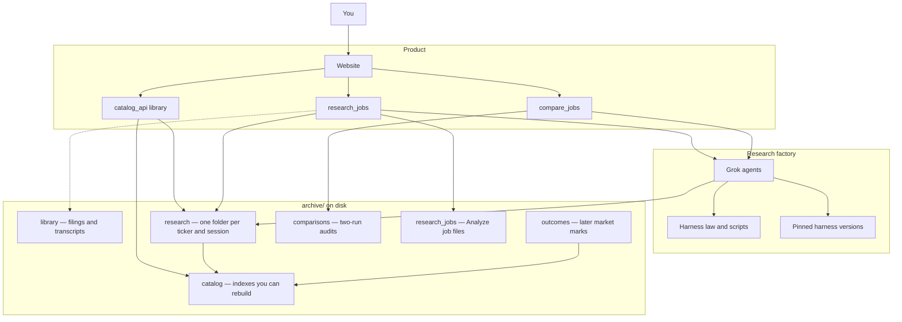
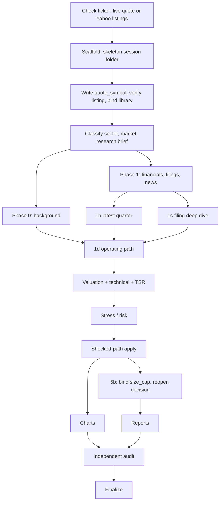
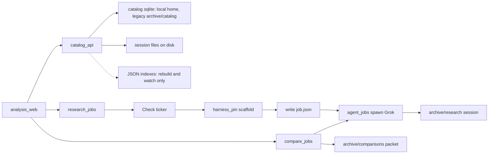

# Architecture — Stock Research Platform

This file is the **human map** of the system. Read it to see how the pieces fit, where records live, and which lines you must not cross.

It is **not** operating law. Research law is `harness/RESEARCH_AGENTS.md`. Build law is `eng/AGENTS.md`. Playbooks, schemas, and changelogs live elsewhere (see [Where to read next](#where-to-read-next)).

The only agent duty here: **do not commit a stale map.** Before every commit, if the change made this file wrong, update it in the same change set. Details: [Keeping this document current](#keeping-this-document-current).

---

## What this system is

This repo is **two modes of work** over one `archive/` disk (the folder that holds every research record).

**Mode A** runs equity research. An orchestrator plus specialist agents take a ticker (the stock symbol used as the folder name) through a phased pipeline and write one complete session: numbers, filings, fair value (the model’s estimate of what the stock is worth), risks, and investor-readable reports.

**Mode B** builds the product around those files. One website is both the reading room and the job starter. The catalog API (`catalog_api`) is an in-process library plus a small CLI — not a second HTTP server.

The pipeline never “remembers” a conclusion in chat. **Files on disk are the record.** The website never invents a fair value or a margin of safety (how cheap the stock is versus that fair value). It may show live Yahoo prices, compute **Downside %** from the **stored** bear fair value versus price, show **Live NAV** as statement ending NAV adjusted by holdings × Yahoo last print (FX frozen at the statement), and show **alternative-history NAV** as a cash book (a frozen copy of IB lots and stock fills, plus what-if fills) marked with Yahoo daily closes. That is display math, not a second valuation. Alternative-history Δ is not Live NAV: same mark on the copy’s actual (replay of the frozen seed and copied fills) and the what-if book, daily close, card and chart end are the same number. Changing the date is the paper account on that day (cash, stock, NAV, paper Reg-T loan / excess / buying power, closes on or before D) — not a second Live NAV. What-if buys may run cash negative (the loan) and are gated on buying power, not cash on hand. A later IB re-ingest does not change a saved history.

Default data root: `archive/` at the project root. `ARCHIVE_ROOT` can point catalog, UI, and tests at another tree. Real Grok Analyze from the website or CLI uses the default archive only.



---

## Two modes

Work in this repo is either **research** or **product engineering**. Mixing them is how fair values get invented in the UI, or how yesterday’s session contaminates today’s.

| | Mode A — Research | Mode B — Build |
|---|---|---|
| **When** | Run equity research on a ticker | Change code, UI, catalog, jobs, harness tooling |
| **Writes** | A **new** folder under `archive/research/<TICKER>/<SESSION_KEY>/`. Also binds library documents into that folder, and updates catalog on finalize. | Code under `eng/`, `packages/`, `apps/`, `programs/`, `scripts/`; `harness/` when changing research runtime. May **append** `archive/library/`, `archive/comparisons/`, `archive/research_jobs/`. May create an **empty** research session folder when Analyze starts (scaffold writes the skeleton; Grok fills it). |
| **Must not** | Browse other research sessions “to see if they’re usable” before a new run | Rewrite completed research or outcomes; invent a fair value |
| **Law** | `harness/RESEARCH_AGENTS.md` | `eng/AGENTS.md` |
| **Entry** | Root `AGENTS.md` (short router only) | Same router, then Mode B files |

Mode B may **schedule** a Mode A run (the Analyze page). The website starts the job and scaffolds the session folder; Grok still writes the research. The website does not fill in valuation JSON. Compare is a separate Grok audit into `archive/comparisons/`, not Mode A phases.

---

## The data plane

Research records live under `archive/` (or `ARCHIVE_ROOT`). Product and harness **code** stays outside that tree. Do not store fair values in a second database. SQLite that the product writes (catalog projection, IB book, alt-history, daily closes, the Grok start lock) lives in a **local home** off the synced tree: `STOCK_RESEARCH_LOCAL` if set, else `%LOCALAPPDATA%\StockResearch` (Windows) or `~/.local/share/stock-research`. Test and fixture `ARCHIVE_ROOT` trees keep sqlite under that archive (tmp catalogs stay self-contained). If a book already exists at `apps/analysis_web/.local/`, the website still reads it until you point `STOCK_RESEARCH_LOCAL` or a local-home copy appears. JSON catalog indexes stay under `archive/catalog/` (rebuildable files). Frozen harness copies live under `pins/` — those are code snapshots, not archive records. Portfolio sqlite is a **trade ledger plus the latest IB snapshot** (overlapping activity CSVs merge; fills are never deleted). Alternative histories are a second sqlite (`alt_histories.sqlite`): at copy time the IB stock book is frozen (seed lots + cash + statement FX and copied stock fills); what-if fills sit on that copy. Later reads do not open the live IB book. They never write the IB trade ledger. Daily closes are a third sqlite (`daily_closes.sqlite`): listing × date × close. Yahoo writes that file through a refresher (HTML prime without waiting, CLI import waits, idle every 30 minutes). Heatmap windows, Play, what-if marks, and price charts read it. Not last prints, not the IB ledger, not archive.

| Folder | What it is | How it may change |
|--------|------------|-------------------|
| `archive/research/` | One complete analysis per ticker and session key | Writable while in progress. **Do not rewrite after `session_is_completed`** (`packages.kd_research.session_state`: snapshot exists, or `run_manifest.immutable` / completed status). New view → new folder. |
| `archive/outcomes/` | Later marks: what the market did after the call | Never edits research. Mark files may be refreshed. |
| `archive/catalog/` | JSON indexes for rebuild and watch. Production sqlite may live in local home | **Index you can rebuild.** Disk sessions are the source of numbers. |
| `archive/library/` | Reusable primary documents (filings, transcripts), not judgments | Add documents, not judgments. **Not in git.** |
| `archive/comparisons/` | Packets from a two-session valuation audit | New folder per job. `job.json` updates in place. Not rebuildable. Not a catalog source. |
| `archive/research_jobs/` | Analyze job status files (`job.json`, pid, prompt, status) | New folder per job. `job.json` updates in place. Not rebuildable. Not a catalog source. |

A research session looks like:

```text
archive/research/<TICKER>/<SESSION_KEY>/
  reports/     README + fundamental + technical (markdown)
  data/        financials, prices, valuation_model.json, compute scripts, raw filings
  charts/      PNGs
  registry/    configs, evidence JSON, phase status, handoffs
  meta/        run_manifest.json, prediction_snapshot.json
```

`SESSION_KEY` is usually the as-of date (`2026-09-05`). A second run the same day becomes `2026-09-05__r2`. Named experiments use a slug: `2026-09-05__model-a`.

**Git:** do not commit `archive/research/`, `archive/outcomes/`, `archive/library/`, `archive/comparisons/`, `archive/research_jobs/`, or `archive/catalog/` indexes (JSON, jsonl, schema_version, SQLite). Those indexes are rebuildable on disk. Do commit harness code. Offline tests may point `ARCHIVE_ROOT` at `eng/fixtures/archive/` (same layout; bulk trees are generated, not versioned).

---

## How a research run happens

A new run is a **new skeleton folder** (not a blank directory), then a sequence of specialists that may not start until prior evidence is on disk. The orchestrator is the lead. Specialists must actually be spawned; the lead must not quietly write their artifacts.

Pipeline:



Check ticker (quote or listings) → scaffold (skeleton, not blank) → write `quote_symbol` + verify listing + bind library → classify/brief. Phase 0 runs in parallel with Phase 1. Then 1b latest quarter ∥ 1c filing deep dive (these wait on Phase 1 only). Then 1d operating path (waits on Phase 0 **and** 1b **and** 1c). Then valuation + technical + TSR. Then stress/risk (workers propose shocks; `python -m packages.kd_research.stress_apply` reruns Agent 5’s `fair_value_under` — not a second model). Then 5b writes `stress_bind` (size cap / expected loss) without rewriting fair value. Then charts ∥ reports (both after stress; reports copy the **Unstressed vs stressed** card; they do not wait on charts). Then audit (waits on **both** charts and reports). Then finalize.

Ideas that hold the pipeline together:

- **Judgment is the model’s job; arithmetic is code’s job.** Agents choose discount rates, paths, and probabilities, and must write *why*. Multi-step math goes in small Python scripts under `data/compute/`, not in prose.
- **The next phase reads files, not chat.** Handoffs and registry JSON are the product.
- **Isolation.** A new run does not open last week’s session to copy a fair value. The document library is source text, not prior conclusions.
- **One writer for valuation.** Agent 5 is the only author of `valuation_model.json`. Do not fan out competing valuers. Specialists must be spawned.
- **Version is recorded at scaffold.** `harness/VERSION` and the git SHA are captured when the folder is created. Finalize copies those fields (fills empty legacy fields only). It does not “upgrade” an old run to today’s harness.

Mechanical gates: `scripts/preflight_phase.py` before later phases, `scripts/check_session.py --full` for structure and decision-quality, `scripts/finalize_session.py` after audit.

You can run Mode A against **live** (the working tree) or against a **pin** (`pins/<semver>/`): a frozen copy of harness law, `packages/kd_research`, and Mode A scripts published when the version was bumped. Old pins must not be edited.

The full phase table, “if X is missing do not start Y,” and quality gates are in `harness/HARNESS_MAP.md` and `harness/RESEARCH_AGENTS.md`.

---

## How the product reads research

The analysis website’s research path is a **read path plus job scheduler**. Analyze scaffolds the session folder, then Grok fills it. Compare is a separate Grok audit, not Mode A phases. Quotes and portfolio sit beside this path; they are not on the diagram.



**Catalog API** (`packages/catalog_api`) is a read-only in-process library plus CLI. Primary identity is `run_id = research:{TICKER}:{session_key}`. Queries **always** use SQLite. JSON indexes are for rebuild and watch, not a fallback. Opening a report uses an allowlist (reports, meta, charts, registry, a few data files) so the UI cannot dump raw filings by accident. If the SQLite schema is older than the client, rebuild; do not paper over it.

`list_runs` / `get_run` hydrate the blotter the website paints: `verdict_line` (column), `decision_action` and `cheap_claim` (from stored extras). Missing fields are null. The extras blob is not a UI API. `RunQuery.latest` returns at most one row per ticker (newest session) **after** other filters, then sort/limit — not a unique of the current page of 50. Sort `asof_downside_pct` is SQL on stored as-of price versus bear FV; it is not a field on the run and not the live-mutated Downside cell.

Rebuild:

```bash
python3 scripts/rebuild_catalog.py
python3 scripts/export_compare_db.py --all --rebuild
```

`rebuild_catalog.py` refreshes JSON indexes. `export_compare_db.py --all --rebuild` recreates the sqlite warehouse only — it does not rewrite `meta/prediction_snapshot.json`. Snapshot freeze stays on finalize.

**Analyze jobs** (`packages/research_jobs`): `ensure_analyze` is idempotent for a live intent. It writes `job.json` as `starting` (that occupies a slot) **before** scaffold, then spawns a detached Grok process. A second Start for the same ticker and as-of date returns that job — it does not create `__r2` while the first is live, failed, or cancelled. `__r2` is for a new intent after complete or abandon. Resume does not re-scaffold. Killing the website must not kill the worker. Cancel is best-effort on the orchestrator PID and **keeps** the session (you can resume). Liveness is worker evidence (`orchestrator_alive` / `session_busy`), not “this integer is dead.” The next UI boot runs `reconcile_jobs` and continues an interrupted start.

**Compare jobs** (`packages/compare_jobs`) take two runs of the **same ticker**. Each session must have `valuation_model.json`. Snapshots are optional (the headline table may be degraded without them). Allocate a packet under `archive/comparisons/` and spawn an independent multi-persona audit via `agent_jobs`. Same-pair live jobs return the existing packet. “Done” means `99_synthesis.md` is on disk.

**Shared spawn/capacity** lives in `packages/agent_jobs` so Analyze and Compare do not each invent PID handling, job.json writes, or liveness. `starting` counts as a running slot. `supervise.py` still does not import this package and still does not tree-kill Grok.

**Pins** (`packages/harness_pin`) **resolve** `live` vs `pins/<semver>/`. The `/harness` page shows the pinned pipeline and can load prompts from that tree.

---

## Code map

| Path | Role |
|------|------|
| `AGENTS.md` | Short dual-mode router. Keep it short. |
| `ARCHITECTURE.md` | This file — human map. |
| `harness/` | Mode A law, schemas, prompts, sector/region notes, version. |
| `packages/kd_research/` | Research runtime library: paths, phase graph, gates, catalog rebuild, spawn gate, library bind, stress apply (`python -m packages.kd_research.stress_apply`). |
| `packages/catalog_api/` | Read-only catalog library + CLI for UI and programs. |
| `packages/research_jobs/` | Analyze job lifecycle. |
| `packages/compare_jobs/` | Compare job lifecycle. |
| `packages/agent_jobs/` | Shared Grok spawn and capacity. |
| `packages/harness_pin/` | Resolves `live` vs `pins/<semver>/`. |
| `apps/analysis_web/` | FastAPI + Jinja website (the product UI). |
| `scripts/` | Mode A CLIs (scaffold, preflight, check, finalize, catalog rebuild, library bind, listing verify, and others) plus `eng_verify.py`. Not a closed list. |
| `programs/` | Small analysis programs over the catalog (e.g. experiment summary). |
| `eng/` | Mode B harness: sessions, fixtures, verify, product runbook. |
| `pins/` | Frozen Mode A snapshots, one folder per semver. |
| `archive/` | Production records (see above). |
| `vendor/mcp/` | Local MCP servers research uses: `sec-edgar-mcp`, `web-fetch-mcp`, `yfinance-market-mcp`. |
| `.grok/` | Skills for this repo, including `.grok/skills/session-valuation-audit`. |

Tests sit next to the code they cover (`packages/*/tests`, `apps/analysis_web/tests`, `scripts/tests`). Baseline for product work: `python3 scripts/eng_verify.py`.

---

## The website

`python3 -m apps.analysis_web` → [http://127.0.0.1:8765/](http://127.0.0.1:8765/)

Stack: FastAPI, Jinja templates, a little static JS (search, live reload, charts). It reads `ARCHIVE_ROOT` (catalog/UI/tests) and **does not author** research phases or fair values. The website never invents a fair value. It may show live Yahoo prices, Downside % from stored bear fair value versus price, Live NAV from holdings × Yahoo last print, and alternative-history NAV from a frozen paper copy of the IB stock book marked with daily closes (plus a paper Reg-T strip on the as-of date) — display math, not a second valuation.

The header groups four primary jobs (Runs, Analyze, Compare, Portfolio) and a quieter Lab (Harness, Architecture, Experiments, Calibration, Health). Full HTML pages go through one `render_page` helper that injects the current section; the template matches that value, not the raw URL.

| Page | What a person uses it for |
|------|---------------------------|
| `/` | List completed runs; filter and sort; optional Latest (one row per ticker). First glance is ticker, as-of/live, FV, MoS, Downside, stored duration, process audit. Pick two of the same ticker to Compare |
| `/runs/{run_id}` | One run: decision strip, football-field PNG + **Read analysis** (composed report) when present, price vs analysis, Context; bear/base/bull/model in details. CIO cover is a text link to `#cio` on the report. |
| `/runs/{run_id}/report` | One **Analysis report** document: English verdict, model, year-by-year forecast table from stored JSON (`explicit_forecast` or a named compute layout), worth vs freeze, then CIO / fundamental / technical as chapters. Desktop: sticky chapter rail. Phone: sticky chapter chips. Display math only — does not invent fair values. |
| `/artifact` | Allowlisted session file (including `data/compute/valuation_result.json`). Markdown uses the same reading shell as the analysis report (chapter rail / chips from that file’s h2s). Architecture and harness still use the plain sanitizer. |
| `/analyze` and `/analyze/new` | Start or watch a Mode A job (`live` or a pin). Start form is ticker + as-of + harness; Busy/Grok-missing stay on the form. |
| `/analyze/{id}` | Wait page is the resume hint (phase token hidden when the hint exists). Complete offers Open catalog run / Read analysis. Cancel keeps the session; discard writes `abandon.json` unless `session_is_completed` |
| `/analyze-artifact` | In-progress session file (handoffs/phase; FV and report bodies blocked until snapshot) |
| `/compares` | Two-run audits. List does not SSE-reload. |
| `/compares/new` | Start a two-session Grok audit. Busy/Grok-missing stay on the form. |
| `/compares/{compare_id}` | Job status, headline table, README + `99_synthesis.md` when complete. Failed jobs can Retry as a new packet. |
| `/compare-artifact` | Allowlisted compare-packet file |
| `/portfolio` | IB book (trade ledger + latest snapshot) or local JSON, joined to latest catalog runs. The header is **Live NAV** and day P/L (not statement period or ending NAV). Live NAV is holdings × Yahoo last print plus statement cash; FX is the statement Forex close. One marked-book poll paints Live NAV, Live cells, live value, Downside, and the heatmap when it is on Live (tile area is \|qty × (last − prev close) × statement FX\|; tiles show the stock’s change % and that holding’s day P/L as % of Live NAV (`day_pl / live_nav`); gainers and losers sit in separate regions). The heatmap card can Fill screen (same SVG, viewport stage, Escape exits) and can switch to a from/to window: one interval still of that range (same P/L as the path: mark change plus IB fill cash; area is \|period P/L\|; NAV % vs start-of-window NAV). Named chips (1W / 1M / YTD / statement) use `GET /api/portfolio/mtm-interval?period=`; custom dates use `start` and `end`. Mark-to-market P/L has its own Live / 1W / 1M / YTD / statement strip plus Play: Live is the IB statement table; Play walks reconstructed daily MTM on those bars. The heatmap does not play frames. Display math, not a valuation. Sub-nav: Book · What-if. |
| `/portfolio/histories` | Alternative histories: frozen paper copies of the IB stock ledger (seed + copied fills). List cards and overlay chart. Does not open the live IB book. |
| `/portfolio/histories/new` | Name only. The only IB read: copies stock trades and freezes seed lots, cash, and statement FX. Later IB re-ingest does not change the copy. |
| `/portfolio/histories/{id}` | First paint is the paper book (lots and cash that day; Close/Value/Weight/Downside/MoS pending, not a blank price). Marks and the NAV path load as their own GETs — copy does not wait on Yahoo. Header cash and Δ are today (path end). Path JSON also carries a last-point Δ breakdown (who contributed, display math). The date picker is the paper account on D: closes on or before D, cash/stock/NAV, paper Reg-T loan/excess/buying power. Holdings join stored catalog snapshots for Weight % of quoted stock, Downside % vs that row’s daily close, and stored MoS (not a valuation). One ticket buys from the searchable researched-name list and sells from a holdings pick. JS POST of a fill returns JSON and does not navigate; without JS the page still redirects. A missing frozen FX rate is an English sentence, not “No statement FX”. Actual is this copy, not a live IB walk. Does not call Live NAV. Works if the IB file is later missing. |
| `/harness` | Pin map and briefing inspector |
| `/experiments`, `/calibration` | Group by experiment; MoS vs later outcomes |
| `/architecture` | Human map: live `ARCHITECTURE.md` (working tree, not a pin). Diagrams are inspectable figures (drag to pan, wheel to zoom, on-figure zoom controls, Reset fits). |
| `/health` | Catalog health + the git SHA this UI process booted at |

Remaining JSON APIs, query params, and live-reload notes: `apps/analysis_web/README.md`.

Live reload: the runs table can refresh when the catalog changes (SSE, with a poll fallback) without wiping an in-progress search.

Quotes and price history read catalog `quote_listing` (stamp, else snapshot, else folder ticker). Portfolio Live NAV uses `print_listing` for the **holding’s market** (IB symbol + exchange; suffix-style Yahoo forms such as `MC.PA`). Catalog overlays that point at a different listing (GDS `HY9H` → Korean `000660.KS`) are for research join only and are not last prints of the lot. Last print is `QuoteService` (one row per listing, 120s, process RAM). `QuoteService.prime` starts that fetch without waiting; `/portfolio` HTML primes listings then joins catalog so Yahoo can overlap the page. `GET /api/portfolio/live-nav` marks current lots with last prints (not a catalog join). Daily closes are `DailyCloses` (`daily_closes.sqlite` in local home, one series per listing). Yahoo is `CloseRefresh` (writer): `/portfolio` HTML, run-detail HTML, and what-if HTML prime it without waiting; IB import waits; an app idle loop catches a new session. `GET /api/portfolio/mtm-interval`, `GET /api/portfolio/mtm-path`, `GET /api/price-history`, and what-if JSON read the store and do not call Yahoo. `GET /api/price-history?range=` is a display slice of that store, not a Yahoo period. Neither map is archive or IB sqlite. The Yahoo fetch layer (`apps/analysis_web/services/yahoo_bars.py`) resolves that string to a chart and returns rows keyed by the request. It does not rewrite the catalog or keep a per-issuer map. `/portfolio` polls `GET /api/portfolio/live-nav` only — not `/api/quotes`. The heatmap window is `GET /api/portfolio/mtm-interval` (one still). Play’s film stays `GET /api/portfolio/mtm-path`. `/portfolio/histories` does not poll Live NAV or last print; it marks a frozen paper copy with stored daily closes. Actual is replay of that copy’s seed and real fills. FX is the statement Forex map frozen at copy (older copies with an empty map still use a lot’s frozen `stmt_fx` of that currency; a truly missing rate is a named block, never a 1.0). The live IB file is opened only on Copy my trades. The editor HTML is the paper book (lots and cash as of the picker date; header cash is today). First paint Close/Value/Weight/Downside/MoS are pending until the held fragment; a missing bar is “no close on or before D”, a missing stored series is unavailable (Retry reloads the fragment; HTML prime writes the store), not a silent dash. Holdings join catalog the same way `/portfolio` does (`catalog_lookup_tickers`, including GDS overlays). `GET /api/portfolio/histories/{id}` is the history document (name, fork, fills) — not holdings. `GET /api/portfolio/histories/{id}/holdings` is the as-of account (marked lots + paper Reg-T); cash lives on `account.cash` as of the view date; display math is on the held fragment, not on `MarkedLot`. `GET /api/portfolio/histories/{id}/path` is the NAV walk from that copy’s fork (header Δ is the last point; `breakdown` is that point’s per-name and cash contribution, not a valuation). `GET /api/portfolio/histories/{id}/universe` and `GET .../ticket` share the same close-on-D marks. `GET /ticket` previews the same Ticket persist uses (`mark`, `cost_base`, `currency`, `after`, `block`, `held_qty`). `POST /portfolio/histories/{id}/decisions` persists that Ticket: JSON `Accept: application/json` returns `{ok, view_date, id, fill}` without navigation; default POST still 303. Buying power is on `block`. Card Δ and the chart’s right end are the same number. What-if buys are allowed to run cash negative and fail only when paper buying power is short.

---

## Identity

These strings show up in URLs, APIs, and job files. Do not invent a parallel ID scheme.

| Kind | Shape | Example |
|------|--------|---------|
| Research run | `research:{TICKER}:{session_key}` | `research:META:2026-09-05` |
| Analyze job | `analyze:{TICKER}:{session_key}` | `analyze:COHR:2026-09-05` |
| Compare packet | `compare:{TICKER}:{packet_key}` | `compare:MELI:2026-08-26__2026-08-23__r2_vs_2026-08-24` |

Compare `packet_key` shape: `{asof}__{A}_vs_{B}`, optional `__rN`.

Harness identity for a run: `harness_version` (from `harness/VERSION` at **scaffold**), plus git SHA. Changing Mode A runtime requires a version bump in the **same** change set: `harness/` except `harness/research/`; `packages/kd_research/`; listed Mode A scripts including `scripts/rebuild_catalog.py`. UI, `catalog_api`, and job packages do not bump.

---

## Invariants

These must stay true. Breaking one usually means silent wrong numbers or rewritten history.

1. **Completed `archive/research/` and `archive/outcomes/` must not be rewritten.** That is process law, not a filesystem lock. Never rewrite them to fix the UI or a test. New analysis → new session key.
2. **No second store of fair values.** The website and catalog read snapshots and session files. They do not compute a competing FV. Display math (live Yahoo price, Downside % from stored bear FV vs price, Live NAV from holdings × last print, alternative-history NAV from cash + lots × daily close, paper Reg-T on that marked book) is not a second valuation.
3. **Catalog is an index you can rebuild.** If SQLite and disk disagree, rebuild from disk. Do not treat the DB as the original.
4. **Library is documents, not conclusions.** Bind into the current session; do not mine other sessions for last week’s MoS.
5. **Mode B home is `eng/`.** Do not create a top-level `build/` harness (that name is gitignored).
6. **English** for schema keys, registry fields, and reports.
7. **User agreement before `git commit`.** Agents may edit and verify; they do not commit until asked.
8. **This architecture map stays true.** See the next section.

---

## Keeping this document current

**Audience of this section:** anyone (person or agent) about to commit.

`ARCHITECTURE.md` is part of the product. A commit that changes how the system is put together and leaves this file describing the old system is incomplete.

### Duty on every commit

Before proposing or making a commit:

1. Diff the change set against the headings below.
2. If a trigger fires, **edit this file in the same change set** so a new reader would not be misled.
3. If nothing architectural changed (typo, test-only, an extra report field inside an existing JSON, a CSS tweak that does not add a page), **leave this file alone**. Do not churn it.
4. Do not move the map into chat, `progress.md`, or a one-off design note and let this file rot.

Mode B write allowlist includes this file. Implementers update it; verifiers reject ships that changed architecture and skipped it. `/smart-commit` treats a stale `ARCHITECTURE.md` as doc debt.

### What counts as architecture (trigger table)

| If the change set… | Update |
|---|---|
| Adds, removes, or renames a top-level package or app | [Code map](#code-map) and the paragraph for that piece |
| Adds an `archive/` plane, or changes who may write/append/rebuild it | [The data plane](#the-data-plane) |
| Changes the Mode A / Mode B split, or who is allowed to author FV / MoS | [Two modes](#two-modes), [What this system is](#what-this-system-is) |
| Changes the research phase graph, isolation, pins, or “one valuer” | [How a research run happens](#how-a-research-run-happens) |
| Changes catalog identity, rebuild, job spawn, or pin resolve | [How the product reads research](#how-the-product-reads-research), [Identity](#identity) |
| Changes `run_id` / `analyze_id` / `compare_id` shapes | [Identity](#identity) |
| Adds/removes a user-facing page, CLI entry, or `ARCHIVE_ROOT` behavior | [The website](#the-website) or the relevant how-to |
| Adds display math that looks like a second valuation (e.g. Downside %) | [What this system is](#what-this-system-is), [The website](#the-website), [Invariants](#invariants) |
| Adds or removes `programs/`, `vendor/mcp` servers, `.grok` skills, or `pins/` | [Code map](#code-map) |
| Adds or drops an invariant | [Invariants](#invariants) |

Mechanical backstop (not a substitute for judgment): `scripts/tests/test_architecture_doc.py` fails if this file is missing, loses required headings, or a new `packages/` / `apps/` directory is not named here. `scripts/eng_verify.py` requires the file to exist.

### How to write edits

- Write for a person. Prefer “the website never invents a fair value” over harness jargon.
- Keep diagrams and tables in sync with the prose.
- Point to law files (`harness/RESEARCH_AGENTS.md`, `eng/AGENTS.md`) instead of copying their rules.
- Do not turn this file into a commit log. Git already is.

---

## Where to read next

| Need | File |
|------|------|
| Dual-mode router (short) | `AGENTS.md` |
| Full research pipeline and quality gates | `harness/RESEARCH_AGENTS.md`, `harness/HARNESS_MAP.md` |
| Product engineering rules | `eng/AGENTS.md`, `eng/HARNESS_MAP.md` |
| Commit how on this checkout | `COMMIT.md` |
| Archive layout and commands | `archive/README.md` |
| Website pages and query params | `apps/analysis_web/README.md` |
| Document library | `harness/library.md` |
| Compare warehouse | `archive/README.md` |
