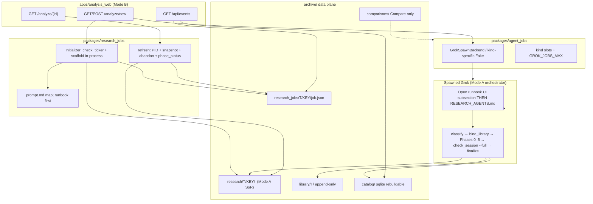
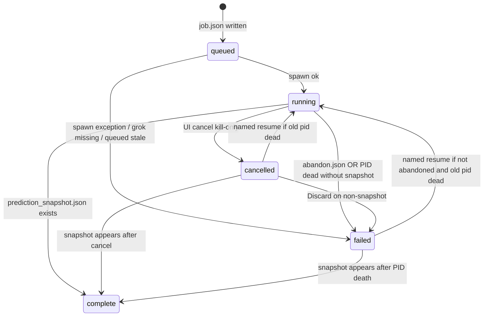
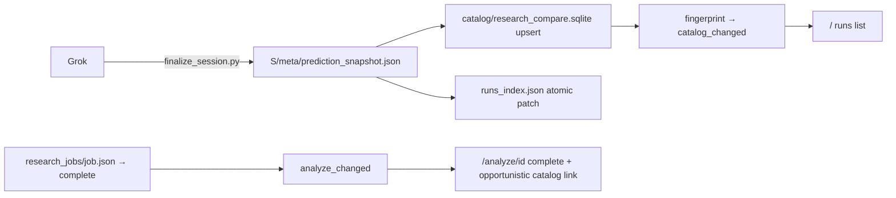

# Mode A Analyze from the Web UI

| Field | Value |
|-------|--------|
| **Title** | Mode A Analyze: schedule the research harness from `apps/analysis_web` |
| **Author** | TBD (eng session implementer) |
| **Date** | 2026-08-28 |
| **Status** | Draft (rev 3 — remaining review nits) |
| **Work types** | W2 (shared runtime + research-job plane) → **W1** (runbook subsection + VERSION) → W2/W4 (SSE/opener) → W4 (UI) → W5 (docs) |
| **Analog** | Session Compare (`packages/compare_jobs`, `apps/analysis_web/routes/compares.py`, eng session `eng/sessions/2026-08-26-ui-session-compare/`) |
| **Normative law** | Mode B: `eng/AGENTS.md`. Mode A: `harness/RESEARCH_AGENTS.md` + `harness/HARNESS_MAP.md` + `harness/orchestrator_runbook.md`. Industry: `harness/research/`. |

---

## Overview

`apps/analysis_web` already **schedules** a background Grok process for **Compare** (Mode B session-valuation-audit → `archive/comparisons/`). This design adds a sibling surface, **Analyze**, that **schedules a Mode A research run** (Phases 0–5) for a ticker that may not exist in the catalog.

The FastAPI process does **not** run the phase graph, does **not** invent FV/MoS, and does **not** dump `harness/RESEARCH_AGENTS.md` into a mega-prompt. It is a Mode B **initializer + job controller**: `check_ticker` (structured abort), in-process `scaffold(..., verify_ticker=False, force=False)`, spawn one Grok orchestrator with a short map prompt that tells it to **open** Mode A law (runbook subsection **first**), then watch `registry/phase_status.json` and mechanical gates (`meta/prediction_snapshot.json` = job complete; `registry/abandon.json` = terminal fail). The spawned Grok process is the Mode A writer of `archive/research/<TICKER>/<SESSION_KEY>/`.

Job-control metadata lives in `archive/research_jobs/` (mirrors `archive/comparisons/`) — **not** inside the research session and **not** in `apps/analysis_web/.local/`. Shared Grok spawn/PID/status machinery is extracted from `packages/compare_jobs/spawn.py` into `packages/agent_jobs/`. Compare and Analyze share a **runtime**, not a job type.

**Cancel is kill-PID only.** Named resume of cancelled/failed hours-long work is in v1. `abandon.json` is reserved for spawn-fail-after-scaffold, orchestrator spawn-or-abandon, and an explicit **Discard** action. Mode B **never** calls `write_abandon` when `prediction_snapshot.json` exists.

The dual-mode story: the UI **reads** the catalog and **schedules** two kinds of Grok jobs. It does not **author** research phases.

Exact FastAPI identity strings (PR 5 `app.py`):

```text
# apps/analysis_web/app.py module docstring (first paragraph)
"""Archive Analysis UI — catalog over packages.catalog_api plus Grok job scheduling.

Does not author research phases, fair values, or MoS. Schedules Mode A
(Analyze → new archive/research sessions) and Mode B Compare
(archive/comparisons/). Reads archive catalog only for completed runs.
"""

# FastAPI(...)
title="Archive Analysis"
description="Catalog UI plus job scheduler: Analyze starts Mode A; Compare appends archive/comparisons/. Does not author phases or FV."
version="2.3.0"
```

---

## Background & Motivation

### Current state

- Mode A is an interactive Grok session at repo root: verify ticker → scaffold → classify → `bind_library.py` → Phases 0–5 with `preflight_phase.py` → audit → `finalize_session.py`. Law lives in `harness/RESEARCH_AGENTS.md`; the root `AGENTS.md` is only a router.
- Mode B UI (`apps/analysis_web`) reads `packages.catalog_api` over `archive/catalog/research_compare.sqlite`. Identity in `apps/analysis_web/app.py` is still “read-only catalog; compare jobs append `archive/comparisons/`.”
- Compare already solved: Grok CLI spawn (`grok --prompt-file … --cwd … --yolo --no-plan --output-format json --session-id <uuid>`), fake backend for tests (`COMPARE_SPAWN=fake`), one-running-job mutex (`CompareBusy`), PID liveness on Windows/POSIX, completion by an on-disk artifact (`99_synthesis.md`), SSE fingerprint of `archive/comparisons/**/job.json`.
- W4 session `eng/sessions/2026-08-28-analysis-unknown-ticker/` made unknown catalog tickers **HTTP 404**. That is correct for **browse**. It is wrong for **Analyze**, whose reason to exist is researching names that are not in the catalog yet. Harness 2.21.0 (`scripts/verify_ticker.py` / `check_ticker`) already distinguishes “not in catalog” from “not a real market symbol.”

### Pain points

1. New-name research requires an interactive Grok chat. The catalog UI cannot start it.
2. Compare’s spawn/PID/status code will be forked if Analyze copies `packages/compare_jobs` instead of extracting a shared runtime (`eng/AGENTS.md` constraint 11).
3. Catalog 404 trains the UI to refuse unknown tickers; Analyze must not reuse `CatalogApi.require_ticker`.
4. Mode A is **hours**, not Compare’s 15–40 minutes. A single global “one Grok process” mutex is too coarse once both features exist, but unbounded fan-out is unsafe (token cost, `--yolo`, machine load).
5. Putting `job.json` / PID / prompt inside `archive/research/<T>/<D>/` mixes product UI state into immutable research history (root `AGENTS.md` Do-not).

### Why now

The user explicitly schedules a black-box research experiment from the UI. That is the exception already written in `eng/AGENTS.md` Purpose and root `AGENTS.md` Mode B rule 3. This design is that scheduling surface — not FastAPI becoming the orchestrator.

---

## Goals & Non-Goals

### Goals

1. From the UI, start a **new** Mode A session for a user-typed ticker (catalog membership **not** required).
2. Follow the **existing** Mode A harness and subagent workflow (Phases 0–5, preflight, isolation, spawn-or-abandon, Agent 5 single-writer, `finalize_session`).
3. Reuse harness as source of truth: short orchestrator prompt + just-in-time load of Mode A law (H1/H3). Do not fork a second pipeline in Python. W1 runbook subsection **must** land before the first real Analyze spawn.
4. Extract shared Grok job runtime from Compare; keep Compare and Analyze as **different job kinds**.
5. Show live progress (`phase_status`, allowlisted **non-FV** artifacts). Until snapshot, report/chart **names+sizes only** (403 bodies).
6. Support **named resume** of cancelled or PID-dead (not abandoned, not snapshotted) folders the user picks. Default path is always-new.
7. **UI cancel = kill orchestrator PID tree only** (no `abandon.json`). Crash (PID death without snapshot/abandon) → job `failed`, resumable. Explicit **Discard** or spawn-fail-after-scaffold → `abandon.json` (terminal). Never abandon a session that has `prediction_snapshot.json`.
8. Tests never call Grok and never invent FV. Fake spawn does not pretend to complete Mode A. Complete-path UI tests use a labeled tmp stub snapshot helper, not the fake backend.
9. Update app identity, nav, README, dual-mode story. `eng/AGENTS.md` constraint 6 footnote + `eng/HARNESS_MAP.md` Mode writes + `archive/README.md` in the same PR that introduces the job plane.

### Non-goals

- FastAPI / Mode B authoring `valuation_model.json`, reports, audit verdicts, or catalog FV columns.
- Re-implementing Phases 0–5, `preflight_phase.py`, or Agent 5 in Python (option (c) is rejected).
- Merging Compare and Analyze into one job type or one prompt.
- Auto-resuming yesterday’s same-ticker session because it “looks usable.”
- Auto-remapping tickers (`BRK.B` → `BRK-B`); harness 2.21.0 forbids it.
- Inserting in-progress runs into `research_compare.sqlite`.
- Harvesting `archive/library/` from Mode A (`harvest_library.py` remains ops-only).
- Git commit from the spawned agent or from the UI.
- Exposing `data/raw_sec/`, transcripts, `grok.log`, or in-progress FV JSON through the UI.
- Multi-Analyze fan-out in v1 (cap is 1 running Analyze).
- A new Grok skill that duplicates `RESEARCH_AGENTS.md`.
- Analyze against a non-default `ARCHIVE_ROOT` (including `eng/fixtures/archive`) in v1.
- Claiming OS sandbox or “cancel stops all Mode A child Groks.”
- `scaffold(..., force=True)` / `--force` / `--legacy` from the initializer.
- FastAPI calling `bind_library.py`, `preflight_phase.py`, `check_session.py`, or `finalize_session.py`.

---

## Key Decisions

| ID | Decision | Rationale |
|----|----------|-----------|
| **K1** | **Initializer (Python) + one Grok orchestrator worker.** In-process `check_ticker` then `scaffold(..., verify_ticker=False, force=False, legacy=False)`, then spawn **one** Grok that follows the harness from classification through finalize. | H5 / R1 / A1. Ticker check and scaffold are mechanical; Phases 0–5 are agent judgment. Rejects per-phase FastAPI Grok and “Grok does verify+scaffold.” |
| **K2** | **Job metadata in `archive/research_jobs/<TICKER>/<SESSION_KEY>/`.** Session artifacts stay in `archive/research/<TICKER>/<SESSION_KEY>/`. Not rebuildable (same as comparisons). Gitignore the tree. | Product UI state must not live under `archive/research/`. `.local/` vanishes when `ARCHIVE_ROOT` changes. `job.json` inside `S/` pollutes the session. |
| **K3** | **Analyze form does not call `CatalogApi.require_ticker`.** Gate is `check_ticker()` (not `require_market_ticker`, which drops `status`/`matches`). Catalog 404 stays on browse. | Two questions: “in the catalog?” vs “a real ticker?” HTTP 400 bodies need `matches` on `abort_match`. |
| **K4** | **Shared runtime `packages/agent_jobs/`; two kinds.** Compare stays a thin adapter. Analyze is `packages/research_jobs`. Compare’s `FakeSpawnBackend(write_synthesis=True)` stays **inside compare_jobs**, not a shared fake Analyze could reuse. | Constraint 11 extract. Do not merge job types. `COMPARE_SPAWN` alias required (`test_compare_jobs.py`, README). |
| **K5** | **Short map prompt; harness is SoR.** ~50–70 lines. Open order: **runbook first** (UI-scheduled subsection at file top), then `RESEARCH_AGENTS.md`, `HARNESS_MAP.md`. One-liners for already-scaffolded, no re-scaffold, no sibling list, price freeze, 5b, `check_session --full`, finalize `--date <session_key>`. Frozen-string tests on prompt + runbook subsection. | Harness > prompt. `RESEARCH_AGENTS.md` still says verify→scaffold; the delta must win **lost-in-the-middle** (C14) by living at the **top** of the runbook the worker is told to open first. |
| **K6** | **Concurrency: per-kind slots + global cap.** Defaults: `ANALYZE_MAX=1`, `COMPARE_MAX=1`, `GROK_JOBS_MAX=2`. Cancel of Analyze is **best-effort** on the orchestrator PID tree (not a proven stop of `spawn_subagent` children). Dual `--yolo` is an accepted v1 risk; operator may set `GROK_JOBS_MAX=1`. | Mode A is hours / ~15× tokens. Compare writes a different tree. Unbounded `--yolo` is unsafe. Today’s single mutex is too coarse. OQ1 is the only remaining user capacity question. |
| **K7** | **Job complete = `prediction_snapshot.json` on disk** (finalize-or-equivalent file). Copy `audit_verdict` + `run_manifest.status` onto `job.json`. UI: “Job complete” ≠ “Audit PASS”. **UI cancel = `kill_pid` only; no `abandon.json`.** Snapshot + abandon both present → `complete` + warning, not abandoned. PID death without snapshot → `failed` (resumable). | Snapshot is what `finalize_session.py` writes; `check_session --full` is orchestrator duty, not FastAPI. Cancel-abandon would make named resume of cancelled dead (Mode A ≥ 2.20.0 terminal). Hours-long work must be resumable after accidental cancel. |
| **K8** | **In-progress sessions are not catalog rows.** Until `snapshot_ready`, 403 **bodies** of FV JSON **and** `reports/` / `charts/` (names+sizes OK on the detail index). After complete, reuse full `DEFAULT_ALLOW_PREFIXES`. | Phase 4 writes FV/MoS into `reports/*.md` **before** finalize. Serving those bodies is the same in-progress-judgment warehouse as `valuation_model.json`. |
| **K9** | **Resume only when the user names the folder** (`analyze_id`). Allowed for `cancelled` and `failed` **without** `abandon.json`, **without** snapshot, and **`pid_alive(old pid)` is false**. Abandoned and snapshotted are not resumable. Default Analyze is always-new (`__r2`). README: confirm no leftover `grok.exe` before resume (v1 cannot prove the child tree is dead). | Isolation: resume iff the user names that folder. Kill-only cancel can leave specialist Groks; a second orchestrator on the same `S` would dual-write (Agent 5 single-writer). |
| **K10** | **Fake spawn never writes under `S/` and never marks Mode A complete.** Complete-path tests use `write_stub_snapshot(tmp_S)` (labeled stub) in tempfile archives only. Fixtures immutable. | Compare’s fake writes `99_synthesis.md` — must not be copied. Implementers must not auto-finalize from FakeAnalyze. |
| **K11** | **MCP: inherit from `cwd=PROJECT_ROOT`; do not block start.** | Mode A §4 already degrades + widens range. Blocking HTTP start would be more brittle than chat. |
| **K12** | **W1 runbook subsection at the TOP of `orchestrator_runbook.md`** (before “New run vs resume”). Title: `## UI-scheduled runs (read this first)`. ~15–25 lines of **deltas only**. Bump `harness/VERSION` 2.21.0 → 2.22.0 **in PR 3**. **PR 5 (UI) depends on PR 3.** Real `GrokSpawnBackend` Analyze (library/CLI) **refuses** unless that heading exists; fake spawn in PR 2 tests is allowed without it. No Grok skill. | Putting “already scaffolded” only in `prompt.md` fights harness > prompt. Placement after the scaffold table loses to C14. First real Analyze Grok must not run before the file it opens. |
| **K13** | **Narrow Mode B write exception (PR 2 edits allowlist + constraint 6 footnote + HARNESS_MAP writes row + `archive/README.md`).** May: (1) create a **new empty** session via in-process `scaffold` (`force=False`, `legacy=False`); (2) append `archive/research_jobs/**`; (3) on **spawn-fail-after-scaffold** or explicit **Discard of a non-snapshotted** session, in-process `write_abandon` (writes `abandon.json` **and** mutates `phase_status.json`). **Never** `write_abandon` if `prediction_snapshot.json` exists (or `run_manifest.immutable` / `status` completed). UI cancel is **not** on this list. Ban `--force`. | `write_abandon` today always mutates `phase_status` and has **no** snapshot guard (`spawn_gate.py`). Constraint 1 forbids rewriting completed history. Constraint 6 currently says app state under `.local/` only — must footnote archive job planes (`comparisons/` already shipped without that footnote). |
| **K14** | **No Grok skill for Analyze.** | Compare’s skill exists because audit is **not** Mode A. A skill restating Phases 0–5 would rot. |
| **K15** | **Layer the ARCHIVE_ROOT gate like Compare.** `start_analyze(archive_root, …)` accepts any root and calls `scaffold(..., output_dir=archive_root)` (tmp tests). **HTTP POST** and **`python -m packages.research_jobs start`** return 400 / exit 2 when **env** `ARCHIVE_ROOT` is set and is not `PROJECT_ROOT/archive`. Unset `ARCHIVE_ROOT` in unit tests; never call production start against live archive. Do **not** put the refuse inside the library with `output_dir=None`. | Mode A CLIs default to `PROJECT_ROOT/archive` unless `--output-dir`. Compare’s `start_compare(archive_root, …)` already works this way. A library-level refuse would force tests onto live `archive/research/` or make tmp tests impossible. Real Grok on tmp is still unsupported (no `--output-dir` injection); tests use fake spawn. |
| **K16** | **v1 isolation is policy + stamped notes + frozen strings, not an OS fence.** Residual is **worse than interactive Mode A** (no human to stop “open yesterday’s META”) and **weaker than Compare** (Compare writes only OUT; Analyze `--yolo` at repo root **must** write `S`). Accepted product risk. Accidental `scaffold_session.py --ticker T --date D` **will** allocate `__r2`; prompt/runbook/tests must name that. | Thesis 7 / H11: mechanical enforcement compounds. We add the cheap fences that do not require a W1 `--no-auto-replicate` on `scaffold_session.py`. Do not claim sandbox. |
| **K17** | **No `force` on Analyze start.** Always-new key. Same `analyze_id` POST while `running` returns the existing job (no `__r2`). `queued` with no live pid and age > 60s → `failed`. | Compare’s `force` re-runs a completed pair. `scaffold --force` overwrites a non-empty folder — forbidden. Compare writes `queued` then spawn in one request; a crashed request must not stick `queued` forever. |

---

## Proposed Design

### 1. Architecture



**Trust boundary:** FastAPI is the scheduler. Grok is the researcher. Catalog sqlite is a **projection** produced by `finalize_session.py`, never a place FastAPI inserts FV.

**Root split (K15):** spawn `cwd=PROJECT_ROOT` so a **real** Grok’s Mode A scripts write `PROJECT_ROOT/archive`. The **library** `start_analyze(archive_root, …)` still scaffolds under the passed root (`output_dir=archive_root`), like Compare. HTTP/CLI refuse when **env** `ARCHIVE_ROOT` is set to something else (fixtures / operator split-brain). No `--output-dir` injection into the worker prompt in v1.

### 2. Shared runtime: `packages/agent_jobs/`

Extract from `packages/compare_jobs/spawn.py` (keep a thin re-export for one PR so Compare tests do not churn twice):

| Symbol | Role |
|--------|------|
| `SpawnResult` | `pid`, `grok_session_id`, `command` |
| `SpawnBackend` | Protocol `spawn(job) -> SpawnResult` |
| `grok_binary()` | `GROK_BIN` or `shutil.which("grok")` |
| `pid_alive` / `kill_pid` | Windows: `OpenProcess` / `taskkill /PID /T /F`. POSIX: prefer `os.killpg` on the session created with `start_new_session=True`; fall back to `SIGTERM` on the one pid. **v1 cancel = best-effort orchestrator tree, not “Mode A stopped.”** |
| `GrokSpawnBackend` | `Popen([grok, --prompt-file, --cwd, --yolo, --no-plan, --output-format json, --session-id])`; stdout → `job_dir/grok.log`; `CREATE_NEW_PROCESS_GROUP` on win32; `start_new_session` on POSIX |
| `default_spawn_backend()` | Env `AGENT_SPAWN` (`grok`\|`fake`). **`COMPARE_SPAWN` remains a required alias** for Compare (`jobs.py` / tests / README). Do not break `default_spawn_backend` in compare_jobs during PR 1: it today reads **only** `COMPARE_SPAWN`. |
| `count_running(archive_root, kind=None)` | After refresh |
| `assert_capacity(archive_root, kind)` | Raises `JobsBusy` |

**Fake backends stay kind-specific.** PR 1 must keep `packages.compare_jobs.spawn.FakeSpawnBackend(write_synthesis=True)` writing `99_synthesis.md` under the **compare packet**. Analyze’s fake lives in `packages.research_jobs` and writes **only** `job_dir`.

**Status machine (shared, stored on each kind’s `job.json`):**

`queued → running → {complete, failed, cancelled}`

Terminal set is frozen **except** named resume of `failed`/`cancelled` (Analyze only, K9) which returns to `running`.

Refresh is kind-specific for **completion evidence**, shared for **PID death**.

**Queued leak:** if `status==queued`, no live pid, and `updated_at` older than **60 seconds** → `failed` with `error="spawn did not start"`. Compare already flips queued→running in one request; Analyze must do the same, plus this refresh backstop.

**Capacity (K6):**

```text
ANALYZE_MAX   default 1   env ANALYZE_MAX
COMPARE_MAX   default 1   env COMPARE_MAX
GROK_JOBS_MAX default 2   env GROK_JOBS_MAX
```

PR 1 introduces the knobs while Analyze is absent: Compare UX stays **one running compare**; global cap 2 is a no-op until Analyze jobs exist. `GROK_JOBS_MAX=1` restores today’s serialize-everything mutex.

`assert_capacity` fails with HTTP 409 if the kind slot or the global cap is full. Same-job GET/POST of an already-`running` row does not consume a new slot and **does not scaffold `__r2`**.

**Do not** put Compare’s `_build_prompt` or `99_synthesis.md` gate in `agent_jobs`.

**Kill safety (v1 known limitation):**

- Record `spawned_at` on the job. Before kill, `pid_alive`; on Windows optionally check image name contains `grok` (weak; do not block kill if the check fails).
- Do **not** claim “cancel stops Mode A.” `spawn_subagent` children may outlive the orchestrator; operators may need `taskkill /IM grok.exe` (README).
- POSIX: `killpg` on the session id from `start_new_session=True` (Compare today sends `SIGTERM` to the one pid — extract should **improve** POSIX for Analyze; Compare can keep the old helper or share `kill_pid`).

### 3. Research job plane: `packages/research_jobs/`

```text
archive/research_jobs/
  <TICKER>/
    <SESSION_KEY>/
      job.json       # Mode B control plane (not a catalog source)
      prompt.md      # short orchestrator prompt (--prompt-file)
      grok.log       # child stdout; not UI-allowlisted
```

`.gitignore` adds `archive/research_jobs/` (PR 2). `*.log` is already ignored. Without the directory rule, `job.json` / `prompt.md` **would be committed**.

Not rebuildable from sessions (PIDs, prompts, status). Backup = disk next to archive, not git, not `rebuild_catalog.py`. `eng/fixtures/archive` must **not** grow this tree.

**IDs**

- `analyze_id` = `analyze:{TICKER}:{SESSION_KEY}`  
  Regex analogous to `COMPARE_ID_RE` / `RUN_ID_RE`.
- `SESSION_KEY` from in-process `scaffold` / `allocate_session_key` (bare `YYYY-MM-DD`, then `__r2`, or `--slug`).

**`job.json` (control plane only — no FV fields)**

```json
{
  "schema_version": 1,
  "kind": "analyze",
  "analyze_id": "analyze:COHR:2026-08-28",
  "ticker": "COHR",
  "session_date": "2026-08-28",
  "session_key": "2026-08-28",
  "run_id": "research:COHR:2026-08-28",
  "session_root": "C:/.../archive/research/COHR/2026-08-28",
  "job_dir": "C:/.../archive/research_jobs/COHR/2026-08-28",
  "status": "running",
  "mode": "new",
  "orchestrator_model": "grok-4.5",
  "subagent_model": "grok-4.5",
  "notes": "UI-scheduled Analyze; session already scaffolded; do not re-scaffold or list archive/research/COHR/ except S.",
  "pid": 12345,
  "grok_session_id": "<uuid>",
  "command": ["grok", "--prompt-file", "..."],
  "project_root": "C:/.../Stock Research",
  "spawned_at": "2026-08-28T12:00:00Z",
  "updated_at": "2026-08-28T12:00:00Z",
  "error": null,
  "mcp_status": "unknown",
  "phase_current": "orch",
  "resume_hint": null,
  "snapshot_ready": false,
  "catalog_run_ready": false,
  "abandoned": false,
  "audit_verdict": null,
  "run_manifest_status": "scaffolded",
  "library_ingest": false
}
```

`phase_current` / `resume_hint` are **copies** from `S/registry/phase_status.json`. Source of truth remains the session file (orchestrator-only writer, except Mode B `write_abandon` on Discard / spawn-fail, which `_mark_phase_status_failed`).

### 4. Start sequence (new run)

```mermaid
sequenceDiagram
  actor User
  participant UI as analysis_web
  participant RJ as research_jobs
  participant CT as check_ticker
  participant SC as scaffold in-process
  participant SP as agent_jobs.spawn
  participant G as Grok orchestrator
  participant S as archive/research/T/KEY

  User->>UI: POST /analyze/new ticker=COHR
  UI->>UI: 400 if env ARCHIVE_ROOT set and not PROJECT_ROOT/archive
  UI->>RJ: start_analyze(archive_root, ticker, asof, model, notes, subagent_model)
  RJ->>CT: check_ticker(COHR, backend=…)
  alt abort_unknown / abort_match / abort_reserved / abort_syntax
    CT-->>UI: 400 JSON includes status + matches (no auto-remap)
  else lookup RuntimeError
    CT-->>UI: 503
  else ok
    RJ->>RJ: if real Grok: refuse unless runbook has UI-scheduled heading
    RJ->>RJ: assert_capacity(kind=analyze)
    RJ->>SC: scaffold(..., output_dir=archive_root, verify_ticker=False, force=False, legacy=False, notes=UI-scheduled…)
    SC->>S: phase_status + session_isolation + run_manifest
    RJ->>RJ: write job.json + prompt.md under research_jobs/
    RJ->>SP: GrokSpawnBackend.spawn(cwd=PROJECT_ROOT, prompt-file)
    alt spawn fails after scaffold
      RJ->>S: write_abandon in-process (empty tree; no snapshot)
      SP-->>UI: 503 GrokMissing; job failed/abandoned
    else spawn ok
      SP->>G: Popen grok --yolo --session-id
      G->>G: open runbook UI subsection, then RESEARCH_AGENTS.md
      G->>S: classify, bind_library, phases, check_session --full, finalize
      UI-->>User: HTML 303 /analyze/{id}
    end
  end
```

**In-process APIs (do not subprocess ticker lookup or scaffold CLI):**

```python
from scripts.kd_research.ticker_lookup import check_ticker
from scripts.scaffold_session import scaffold

result = check_ticker(raw, backend=backend)  # tests: FakeBackend
# map result.status:
#   ok -> continue with result.canonical
#   abort_match -> HTTP 400 {status, reason, matches}
#   abort_unknown / abort_reserved / abort_syntax -> HTTP 400 {status, reason}
# RuntimeError from live yfinance -> HTTP 503 (CLI exit 4 analog)

root = scaffold(
    ticker,
    session_date,
    output_dir=archive_root,  # Compare-shaped; tests pass tmp. HTTP/CLI already gated env.
    force=False,
    legacy=False,
    slug=slug,
    orchestrator_model=orch,
    default_subagent_model=sub,
    notes=(
        "UI-scheduled Analyze; session already scaffolded; "
        "do not re-scaffold or list archive/research/"
        f"{ticker}/ except this session_key."
    ),
    auto_replicate=True,
    verify_ticker=False,  # already checked; CLI has no --backend
)
```

Do **not** call `require_market_ticker` (drops `matches`). Do **not** call `scaffold_session.py` as a subprocess (second live Yahoo hit; no FakeBackend). Hard-deny `--force` / `force=True` / `--legacy`.

**Env gate vs library (K15):**

```python
def env_archive_is_non_default() -> bool:
    raw = os.environ.get("ARCHIVE_ROOT")
    if not raw or not raw.strip():
        return False
    return Path(raw).expanduser().resolve() != (PROJECT_ROOT / "archive").resolve()

# HTTP POST / CLI start ONLY — not inside start_analyze:
if env_archive_is_non_default():
    raise AnalyzeArchiveRootError(...)  # HTTP 400 / CLI exit 2

# start_analyze(archive_root, ...) always:
#   scaffold(..., output_dir=archive_root)
# Unit tests: unset ARCHIVE_ROOT; pass tempfile archive_root.
```

**Real-Grok runbook gate (PR 2, before PR 3 heading exists):**

```python
UI_SCHEDULED_HEADING = "## UI-scheduled runs (read this first)"

def runbook_has_ui_scheduled_heading(project_root: Path) -> bool:
    text = (project_root / "harness" / "orchestrator_runbook.md").read_text(encoding="utf-8")
    return UI_SCHEDULED_HEADING in text

# Inside start_analyze, only when spawn backend is real Grok (not FakeAnalyze):
if isinstance(backend, GrokSpawnBackend) and not runbook_has_ui_scheduled_heading(PROJECT_ROOT):
    raise AnalyzeRunbookMissing(
        "UI-scheduled runbook heading missing; merge W1 PR 3 before real Grok Analyze"
    )
# Fake spawn (PR 2 tests) skips this gate.
```

**HTTP start budget:** ticker lookup is seconds (yfinance). Scaffold is milliseconds. Do **not** wait for Mode A.

**Response codes (match Compare; no “202/303” mush):**

| Surface | Success | Busy | Grok missing | Ticker abort | Bad ARCHIVE_ROOT |
|---------|---------|------|--------------|--------------|------------------|
| HTML POST `/analyze/new` | **303** to `/analyze/{id}` | 409 page | 503 page | 200 form with error (or 400 page) | 400 page (env `ARCHIVE_ROOT` set and not default) |
| JSON POST `/api/analyze` | **202** job body | 409 | 503 | 400 `{status, reason, matches?}` | 400 (same env gate) |

**Optional library ingest (Mode B append, before spawn):** checkbox `ingest_library`, **default off**. Runs in-process / `ingest_library.py --ticker T` on `_inbox/` if present. Never `harvest_library.py`. Empty library is valid; Grok still `bind_library.py` later.

**Same-id while running:** if a running job already exists for this ticker+session_key, return it (Compare pattern). A **new** Analyze with no slug on the same calendar day scaffolds `__r2` (new id), subject to capacity.

### 5. Orchestrator prompt (progressive disclosure)

`packages/research_jobs/prompt.py` writes `prompt.md`. This is the entire prompt — **not** a paste of `RESEARCH_AGENTS.md`.

**Open order is load-bearing:** the UI-scheduled delta must be seen **before** `RESEARCH_AGENTS.md`’s “verify ticker → scaffold” (C14). Frozen-string tests (`test_law_surface_freeze.py` spirit) assert the prompt contains the exact isolation / already-scaffolded strings and that `orchestrator_runbook.md` starts with the UI-scheduled heading.

```text
You are the Mode A research orchestrator for a UI-scheduled run.

Open and follow, in this order, before Phase 0:
1. harness/orchestrator_runbook.md — read "## UI-scheduled runs (read this first)" FIRST
2. harness/RESEARCH_AGENTS.md (full law) — do NOT re-verify/re-scaffold; that already happened
3. harness/HARNESS_MAP.md
4. harness/agent_prompts.md (when spawning; slice per subagent — do not dump into children)

This prompt is a map, not a substitute for those files.

HARD RULES
- Session is ALREADY scaffolded. Do not run scripts/verify_ticker.py.
  Do not run scripts/scaffold_session.py (a same-day call WILL allocate __r2
  and desync this job). Do not list archive/research/<TICKER>/ except S.
- Work only under S (absolute path below). Intra-session sharing is required.
- Isolation: read S/registry/session_isolation.json and meta/run_manifest.json notes.
  Do not open other session_keys for FV, MoS, thesis, handoffs, or
  “is yesterday usable?”
- Do not git commit.
- Agent 5 is the single writer of valuation / decision.json (including 5b reopen
  after Phase 2.5 — lead, do not spawn subagent 5 in 2_5).
- Specialists MUST be spawn_subagent + scripts/record_spawn.py. Spawn failure →
  scripts/abandon_session.py then STOP. Never write specialist artifacts as the lead.
- After research_brief, run scripts/bind_library.py before Agent 2b.
  Read harness/library.md (you and 2b only).
- Preflight before phases 1_parallel / 2_parallel / 2_5 / 4_parallel / 5.
- Before Phase 2: freeze data/price_snapshot.json (price-only; no FV).
- After audit PASS or explicit README waivers: python3 scripts/check_session.py
  --ticker T --date <session_key> --full then
  python3 scripts/finalize_session.py --ticker T --date <session_key>
  (session_key, including __r2 / slug — not bare date if they differ).
- MCP/tools may fail. RESEARCH_AGENTS.md §4: log, fallback, widen range.
  Do not invent a company or numbers.
- English only for registry keys, schemas, reports.
- Do not write archive/outcomes or archive/research_jobs (ignore them).
  Job control is Mode B’s file.

TICKER: {ticker}
session_date: {session_date}
session_key: {session_key}
S: {session_root}
ROOT: {project_root}
orchestrator_model: {orchestrator_model}   (already stamped in meta/run_manifest.json)
default_subagent_model: {subagent_model}

Start at orchestrator classification (sector_config + market_context + research_brief).
phase_status.json is pending. Stop when finalize_session succeeds, or when you
write registry/abandon.json.
```

**Resume prompt** replaces the last paragraph only:

```text
RESUME the named folder S only. Read registry/phase_status.json and resume_hint.
Do not re-run agents already complete (5b carve-out after 2.5 still applies).
Do not browse other session_keys. Do not scaffold. Do not verify_ticker.
```

Edge placement (C14): hard rules at the **start**; `S` / stop conditions at the **end**.

**W1 runbook subsection (PR 3) — exact insertion point**

File: `harness/orchestrator_runbook.md`  
Insert **immediately after the opening anti-role paragraph**, **before** `## New run vs resume (read first)`.

Title: `## UI-scheduled runs (read this first)`

Contents (deltas only — do not paste the phase graph):

- This session was scaffolded by Mode B Analyze. `S` is already on disk. `meta/run_manifest.json` already has `orchestrator_model`.
- Do **not** `verify_ticker` / `scaffold_session.py`. Same-day scaffold **auto-allocates `__r2`** and will desync `archive/research_jobs/`.
- Work only under `S`. Do not list `archive/research/<TICKER>/`. Isolation file + run_manifest.notes repeat this.
- `archive/research_jobs/` is Mode B control; ignore it.
- `finalize_session.py --date` is the **full session_key** (`YYYY-MM-DD__r2` / slug).
- Do not git commit.
- All other runbook rules (preflight, bind_library, price_snapshot freeze, 5b, spawn-or-abandon, check_session --full) still apply.

Frozen-string test: heading present at file top (before “New run vs resume”); contains `already scaffolded` and `__r2`.

### 6. Isolation vs live UI

| Actor | Allowed | Forbidden |
|-------|---------|-----------|
| **Grok worker** | `S/**`, `harness/**`, `scripts/**`, `templates/**`, `sector_*.md`, `region_*.md`, `archive/library/<T>/` only via `bind_library.py` / 2b unlabeled rule | `archive/research/<T>/<other-key>/`, listing ticker folder “to see if yesterday is complete”, `archive/outcomes`, other tickers’ sessions |
| **FastAPI / UI** | List `archive/research_jobs`, list catalog completed runs, read **in-progress allowlist** under **this** `S` | Writing FV; showing other same-ticker sessions **to the worker**; injecting sibling paths into `prompt.md`; serving in-progress FV JSON **or report/chart bodies** |

**Mechanics (not an OS sandbox):**

- `--cwd` = project root (required: harness, `.mcp.json`, scripts, `spawn_subagent`). Cannot chroot to `S`.
- Prompt hard-rule (Compare analog: named paths only).
- `session_isolation.json` (`allow_prior_session_keys: []`) as today.
- `run_manifest.notes` stamped by initializer (K16).
- Frozen-string tests on prompt + runbook.
- `check_session` isolation is **after the fact**.

**Accepted residual (sign this in README):** unattended `--yolo` at repo root can still `list_dir archive/research/T`. That is **worse than chat** (no human interrupt) and **weaker than Compare** (Compare never needs to write research). v1 does not add W1 `--no-auto-replicate` on `scaffold_session.py`. Accidental re-scaffold **will** create `__r2`; job still watches `job.session_root`.

UI may render “other completed runs for this ticker” **after** `snapshot_ready`, never as worker context. While running, the detail page does **not** embed prior FV tables.

### 7. Progress, completion, cancel, crash, discard

| Action | Session | Job status | Resume? |
|--------|---------|------------|---------|
| **UI Cancel** | `kill_pid` only; **no** `abandon.json`; **no** `phase_status` edit | `cancelled` | **yes**, named id, **if old pid dead** |
| Spawn-fail after scaffold | in-process `write_abandon` (empty tree; snapshot cannot exist) | `failed` + `abandoned` | no |
| Orchestrator spawn-or-abandon | Mode A writes `abandon.json` | `failed` + `abandoned` | no |
| PID death (no snapshot, no abandon) | no abandon | `failed` | **yes** |
| Explicit **Discard** | kill + `write_abandon` **iff no snapshot** | `failed` + `abandoned` | no |
| Snapshot exists | never abandon (even if discard/cancel races finalize) | `complete` | no (new run) |
| Snapshot **and** abandon both on disk | do not treat as abandoned | `complete` + `error` warning | no |



**`refresh_analyze` (every list/get; SSE does *not* call this):**

1. If `S/meta/prediction_snapshot.json` exists → mark **`complete`** / `snapshot_ready=true` **regardless of prior `cancelled`/`failed`** (orphan Grok may still finalize after kill-only cancel). Copy `audit_verdict` from `registry/audit.json` or snapshot; copy `run_manifest.status`. If `abandon.json` also exists, set `error` warning `"abandon.json present on finalized session; not treating as abandoned"` and keep `abandoned=false`. Snapshot always wins.
2. Else if `S/registry/abandon.json` exists → `failed`, `abandoned=true`, copy reason into `error`.
3. Else if `status==running` and pid not alive → `failed`, `error="Grok process exited before finalize"`.
4. Else if `status==queued` and no live pid and age > 60s → `failed`.
5. Copy `current_phase` + `resume_hint` from `phase_status.json` if present.
6. `catalog_run_ready`: try sqlite `get_run(run_id)` (do **not** require this for job `complete` — an orchestrator that wrote the snapshot without `finalize_session` still trips the file gate; the catalog link is opportunistic).
7. Atomic write `job.json` if changed.

**Job complete ≠ session-quality complete.** `finalize_session.py` writes the snapshot **without** `check_session.py --full`; audit FAIL is still exportable. Detail page copy:

> Job complete (finalize snapshot on disk). Audit: {PASS\|FAIL\|—}. This is not a buy list. Open catalog run if indexed.

Do **not** have FastAPI run `check_session`. Stronger gate “snapshot **and** sqlite row” is **rejected for v1**: it would leave jobs `running` forever if Grok wrote the snapshot but failed the catalog patch; the file is the Mode A SoR. Catalog link is try/except `RunNotFound`.

**Cancel (`research_jobs.cancel`):**

```python
# never write_abandon
kill_pid(job["pid"])  # best-effort tree; see §2
job["status"] = "cancelled"
# do not delete S
```

**Discard (`research_jobs.discard`):**

```python
if (session / "meta" / "prediction_snapshot.json").is_file():
    raise DiscardRefused("session already finalized")  # HTTP 409
kill_pid(job["pid"])
from scripts.kd_research.spawn_gate import write_abandon
write_abandon(session, reason="ui_discard", detail="UI discard")
# success predicate: abandon.json exists; do NOT use abandon_session.py exit code
# (CLI always return 1 on successful abandon)
job["status"] = "failed"
job["abandoned"] = True
```

`write_abandon` mutates `phase_status.json` (`_mark_phase_status_failed`). That is allowed **only** for Discard / spawn-fail on **non-snapshotted** sessions and must be named on the Mode B allowlist. Tests: tmp session **with** a stub snapshot → cancel **and** discard must **not** write `abandon.json` or change `phase_status`.

**Long-running UX**

- GET `/api/analyze/{id}` **always** `refresh_analyze` (like Compare GET). `analyze_detail.js` polls every **5s**.
- SSE `analyze_changed` from fingerprint (below). Poll rewrite of `job.json` is what makes PID-death visible to SSE, same as Compare.
- Do not fingerprint the entire session tree.

**Expected load / latency**

| Item | Target |
|------|--------|
| POST `/analyze/new` (check_ticker + scaffold + spawn) | < 15s typical; 30s timeout; 503 on ticker lookup error |
| GET job JSON | < 100ms local disk |
| Mode A wall time | 2–8 hours typical; no HTTP long-poll |
| Concurrent Analyze | 1 |
| Concurrent Compare | 1 (may overlap Analyze if `GROK_JOBS_MAX>=2`) |
| Job metadata size | < 50 KB + grok.log (unbounded; not served) |

### 8. Unknown tickers vs catalog 404

| Route | Gate | Unknown example |
|-------|------|-----------------|
| `GET /?ticker_prefix=ZZZNOPE` | `CatalogApi.require_ticker` | HTTP 404 “Aborted” (keep) |
| `GET /api/runs?ticker=NOPE` | same | 404 (keep) |
| `GET /compares?ticker=NOPE` | same | 404 (keep) |
| `GET /analyze` `?ticker=NOPE` | **none** (`require_ticker` **forbidden** — copy-paste fail from `page_compares`) | **200 empty list**, not 404 |
| `GET /analyze/new` | none | 200 form |
| `POST /analyze/new` ticker=`ZZZNOPE` | `check_ticker` | 400 `abort_unknown` (CTA from catalog 404 still market-checks) |
| `POST /analyze/new` ticker=`APPL` | same | 400 `abort_match` + `matches` (no auto-remap) |
| `POST /analyze/new` ticker=`ENG` | same | 400 `abort_reserved` |
| `POST /analyze/new` ticker=`COHR` not in catalog | market quote ok | HTML 303 / JSON 202, new session |

**Catalog 404 card CTA:** only when `error_kind == ticker_not_found`. Link `Start Mode A analysis for {ticker_query}` → `/analyze/new?ticker=` + URL-encoded query. POST still 400 on `ZZZNOPE`. Do not skip `check_ticker` because the user came from 404.

**Reserved names:** `ROOT_RESERVED_NAMES` (`scripts/kd_research/paths.py`).

### 9. Catalog freshness



- **In progress:** invisible on `/` (no sqlite row). Visible on `/analyze`.
- **Just finalized:** existing `finalize_session` patch. SSE `catalog_changed`. Job detail “Open catalog run” if `get_run` succeeds.
- **Do not** `export_compare_db --all --rebuild` from the UI.
- **Do not** have FastAPI write sqlite.

### 10. MCP / tools

Mode A needs `yfinance`, `sec-edgar`, `web-fetch` (project `.mcp.json`). Compare does not.

| Mechanism | Detail |
|-----------|--------|
| Discovery | Spawn `cwd=PROJECT_ROOT` so Grok loads the same workspace MCP as chat. |
| Probe | Record `mcp_status=unknown`. Do **not** fail POST because MCP is down. |
| Degraded run | Mode A §4; UI badge if later marked `degraded`. |
| Tests | Fake spawn never starts MCP. |

### 11. Resume and Discard

**Default:** always-new (`mode=new`). Same-day second **new** click allocates `YYYY-MM-DD__r2`.

**Resume:** `POST /analyze/{id}/resume` (HTML 303, JSON 202). Allowed iff:

- `job.json` exists
- `S` exists
- `abandoned` is false
- no `prediction_snapshot.json`
- status in `{failed, cancelled}` (or `running` with dead PID — refresh will have marked `failed`)
- **`pid_alive(job["pid"])` is false** (necessary, not sufficient if children were re-parented)
- user posted the exact `analyze_id`

If the old pid is still alive → HTTP **409** “orchestrator still running; cancel first or wait.” Do not spawn a second writer on `S`.

README (cancel **and** resume): confirm no leftover `grok.exe` before resume. v1 does **not** claim a process-tree proof.

Effects: capacity check, resume `prompt.md`, new spawn, `mode=resume`, new pid/session-id, status `running`. Do not re-scaffold. Do not rewrite `session_isolation.json`.

Abandoned: copy “Terminal — start a new analysis.” No resume button. Discard is the explicit terminal path.

### 12. App identity

Update in **PR 5** (UI code) + **PR 6** (docs polish):

- Module docstring + `FastAPI(description=…)` as in Overview (does **not author** phases; **schedules** Mode A).
- `templates/base.html` subtitle/nav: **Analyze** beside Compares. Subtitle must not say “catalog read-only” only.
- README: Analyze pages, env, concurrency, isolation residual, 404 CTA, ARCHIVE_ROOT **env** gate (library still takes `archive_root`), cancel ≠ abandon, leftover `grok.exe` after cancel **and before resume**.
- Root `AGENTS.md`: at most one quick-command line if the file stays **≤150 lines** (`test_router_agents.py` / `eng_verify`). **PR 6** test counts lines.
- `eng/HARNESS_MAP.md` Mode **writes** row + data-plane tree: land in **PR 2** (not only a “data-plane line”).
- `eng/AGENTS.md` write allowlist + constraint 6 footnote: **PR 2**.
- `archive/README.md`: **PR 2**.

App version: `2.2.0` → `2.3.0` (independent of harness 2.22.0).

### 13. Mechanical pipeline vs Grok freedom (evaluated)

| Option | What | Verdict |
|--------|------|---------|
| **(a)** Grok runs every script including verify+scaffold | Closest to chat; FastAPI only Popen | Reject as default: worker can browse `archive/research/T/` before scaffold; ticker check can be skipped. |
| **(b)** FastAPI initializer (`check_ticker` + scaffold) then **one** Grok worker | Code does known-pipeline start; agent does open-ended research | **Accept (K1).** |
| **(c)** Mode B job runner sequences phases and spawns Grok per phase | FastAPI owns the graph | **Reject.** Re-implements Mode A; Google 2026 sequential multi-agent harm. |

FastAPI **must not** call `bind_library.py`, `preflight_phase.py`, `check_session.py`, or `finalize_session.py`. Orchestrator duties in the **map prompt** (one-liners) + runbook: price freeze, 5b, `check_session --full`, finalize with full `session_key`.

---

## API / Interface Changes

### New HTML routes (`apps/analysis_web/routes/analyze.py`)

| Method | Path | Behavior |
|--------|------|----------|
| GET | `/analyze` | Job list; optional `?ticker=` **without** `require_ticker`; unknown → **200 empty** |
| GET | `/analyze/new` | Form: ticker, as-of date default today, optional slug, optional **notes**, orchestrator model default `grok-4.5`, optional **subagent model** (default = orchestrator), ingest_library checkbox **default off**, confirm (hours) |
| POST | `/analyze/new` | `start_analyze` → **303** `/analyze/{analyze_id}` |
| GET | `/analyze/{analyze_id:path}` | Live detail: status, phase table, resume_hint, **in-progress allowlist**, cancel / resume / discard |
| POST | `/analyze-cancel` | Form POST; kill-only; 303 |
| POST | `/analyze-discard` | Form POST; `write_abandon` if no snapshot; 303 or 409 |
| POST | `/analyze/{id}/resume` | Named resume → 303 |
| GET | `/analyze-artifact` | In-progress: handoff/phase/manifest bodies; **403** report/chart/FV bodies. After complete: full catalog prefixes |

Form fields passed into scaffold: `notes`, `subagent_model` (not only orchestrator).

### New JSON routes (under `/api`)

| Method | Path | Status |
|--------|------|--------|
| GET | `/api/analyze` | 200 `{jobs, count}` |
| POST | `/api/analyze` | **202** body `{ticker, session_date?, slug?, orchestrator_model?, subagent_model?, notes?, ingest_library?}` — **no `force`** |
| GET | `/api/analyze/{analyze_id}` | 200 job + `phase` projection (**always refresh**) |
| POST | `/api/analyze/{id}/cancel` | 200 job |
| POST | `/api/analyze/{id}/discard` | 200 or 409 |
| POST | `/api/analyze/{id}/resume` | 202 job |

Errors: 400 validation / ticker abort (`status`, `reason`, `matches` on `abort_match`) / env `ARCHIVE_ROOT` set and not default; 409 busy / discard of snapshotted / resume while old pid alive / real Grok without runbook heading; 503 `GrokMissing` or ticker lookup `RuntimeError`; 404 unknown `analyze_id`.

### CLI

```text
python -m packages.research_jobs start --ticker COHR [--date 2026-08-28] [--slug …] [--model grok-4.5] [--subagent-model …] [--notes …]
python -m packages.research_jobs get analyze:COHR:2026-08-28
python -m packages.research_jobs list [--ticker COHR]
python -m packages.research_jobs cancel analyze:COHR:2026-08-28
python -m packages.research_jobs discard analyze:COHR:2026-08-28
python -m packages.research_jobs resume analyze:COHR:2026-08-28
```

Env: `GROK_BIN`, `AGENT_SPAWN=fake`, `COMPARE_SPAWN` (alias), `ANALYZE_MAX`, `COMPARE_MAX`, `GROK_JOBS_MAX`, `RESEARCH_ORCHESTRATOR_MODEL`. CLI `start` (and HTTP POST) refuse when **env** `ARCHIVE_ROOT` is set and is not `PROJECT_ROOT/archive` (exit 2 / HTTP 400). The library `start_analyze(archive_root, …)` does **not** read that env for a refuse; tests pass a tmp root with `ARCHIVE_ROOT` unset. Real Grok Analyze is still only safe on the default tree (no `--output-dir` injection).

### Compare compatibility

`packages/compare_jobs` public API unchanged. Internals import spawn from `packages.agent_jobs`. `CompareBusy` remains. `COMPARE_SPAWN=fake` still selects the **compare** fake that writes `99_synthesis.md`. Tests in `scripts/tests/test_compare_jobs.py` stay green.

### CatalogApi / artifact opener

- **No** in-progress rows in sqlite.
- `CatalogApi.get_session_root(run_id)` already resolves `research/{T}/{KEY}` **without sqlite** if the folder exists. Still add a helper that opens a **raw `session_root`** so Analyze routes never call `require_ticker` / `get_run` for in-progress jobs.
- **In-progress allowlist** (`snapshot_ready=false`):
  - allow **bodies:** `registry/phase_status.json`, `registry/session_isolation.json`, `registry/handoffs/`, `meta/run_manifest.json`
  - allow **names+sizes only** (index on the detail page): `reports/`, `charts/` — **GET body → 403**
  - **deny bodies and deep-links:** `data/valuation_model.json`, `registry/decision.json`, `registry/audit.json`, `meta/prediction_snapshot.json`, `data/raw_sec/`, `data/transcripts/`, `grok.log`, `reports/**`, `charts/**`
- **After complete:** reuse `DEFAULT_ALLOW_PREFIXES` / `DEFAULT_DENY_PREFIXES` (report/chart bodies allowed).
- Tests: running job GET `data/valuation_model.json` → **403**; running job GET `reports/00_*_README.md` → **403** even if the file exists in tmp. After `write_stub_snapshot`, report bodies 200.
- Detail page while running: list report/chart **names+sizes**; do not render markdown/PNG bodies; **no FV numbers**. `job.json` may be shown as control metadata.

### SSE (`apps/analysis_web/services/change_feed.py`)

Fingerprint **walks directories, no JSON parse** on the 1.5s interval (cap 200):

```text
archive/research_jobs/<T>/<KEY>/job.json          → analyze:{T}:{KEY}=mtime:size
archive/research/<T>/<KEY>/registry/phase_status.json  → phase:{T}:{KEY}=mtime:size
```

Sibling `phase_status` is inferred by **directory identity** (`research_jobs` ticker/key → `research` ticker/key), not by reading `job.json["session_root"]`.

`classify_change`:

- any `analyze:*` or `phase:*` key change → **`analyze_changed` only**
- must **not** fall through to `if not events: catalog_changed` (`change_feed.py` today lines 117–118)
- sqlite / runs_index → `catalog_changed` only (no `analyze_changed`)

`live.js`: special-case `analyze_changed` + `data-live-analyze="1"` the same way as `compare_changed` + `data-live-compare`. Analyze **list** page should not full-reload as generic catalog change.

Tests: touch `phase_status` only → `analyze_changed` not `catalog_changed`; touch sqlite → `catalog_changed` only.

GET list/detail still `refresh_analyze` so PID-death rewrites `job.json` and then trips SSE.

---

## Data Model Changes

### New tree

```text
archive/
  research/         # SoR sessions — Mode A Grok writes; Mode B may scaffold-new + write_abandon only on spawn-fail/Discard of non-snapshotted
  outcomes/         # immutable marks
  catalog/          # rebuildable projection (completed runs)
  library/          # append-only documents
  comparisons/      # Compare packets (not rebuildable; not git)
  research_jobs/    # NEW: Analyze control plane (not rebuildable; not git; not a catalog source)
```

### Schema / templates

No `templates/*.schema.json` change in v1. Defer `templates/research_job.schema.json` (templates/ is a VERSION-bump path if treated as Mode A). Validate required `job.json` keys in Python.

### Migrations

None.

### Normative Mode B edits (all in **PR 2** except VERSION)

**`eng/AGENTS.md` write allowlist:**

```text
Allow append: archive/library/**
Allow append: archive/comparisons/**
Allow append: archive/research_jobs/**
Allow create: new empty archive/research/<T>/<new-key>/ via in-process scaffold_session.scaffold
              (force=False, legacy=False, verify_ticker=False after check_ticker)
Allow: registry/abandon.json AND registry/phase_status.json mutation via
       spawn_gate.write_abandon only for (a) spawn-fail-after-scaffold or
       (b) UI Discard of a session with no meta/prediction_snapshot.json
Deny: write_abandon / phase_status edits when prediction_snapshot.json exists
      or run_manifest.immutable / status completed
Deny: rewrite of completed archive/research/** and archive/outcomes/**
Deny: Mode B writes of valuation_model.json, reports, audit.json, prediction_snapshot.json
Deny: scaffold force=True / --legacy from Analyze
```

**`eng/AGENTS.md` constraint 6 footnote:** App UI state (portfolio book) stays under `apps/<name>/.local/`. **Archive job planes** (`archive/comparisons/`, `archive/research_jobs/`) are append-only data-plane packets next to `archive/`, not app-local state. This also documents the Compare exception that shipped without a footnote.

**`eng/HARNESS_MAP.md` Modes writes row** (today omits comparisons): Mode B writes `eng/packages/apps/programs/scripts`; append `archive/library/`, `archive/comparisons/`, `archive/research_jobs/`; may create a new empty research session via Analyze initializer. Data-plane tree adds `research_jobs/`.

**`archive/README.md`:** layout line for `research_jobs/`; Rules “Not in git” includes it; one-liner: control plane, not a catalog source, not rebuildable; backup = disk.

### Fixtures

`eng/fixtures/archive/` does **not** contain Analyze jobs. Tests use `tempfile` with **`ARCHIVE_ROOT` unset** and `start_analyze(tmp_archive, …)`. HTTP/CLI against fixture `ARCHIVE_ROOT` is refused (env gate). Do **not** add fake FV sessions under fixture `research/`.

---

## Alternatives Considered

### A. Per-phase Grok processes sequenced by FastAPI (option c)

Rejected: second harness; Agent 5 sequential writes across processes; Google 2026 sequential multi-agent harm.

### B. Job.json inside `S/`

Rejected: product UI state under `archive/research/`; Mode B would rewrite `S` after finalize.

### C. Job store in `apps/analysis_web/.local/jobs/`

Rejected as primary store (Compare precedent; `ARCHIVE_ROOT` visibility). Constraint 6 is **amended with a footnote** (K13) rather than silently adding a second exception.

### D. Always-new only (no resume)

Rejected as the only path. Isolation allows named resume; cancel is kill-only so cancelled hours of work are not discarded.

### E. Dump RESEARCH_AGENTS.md / add a Mode A skill

Rejected: encyclopedia dump; Compare’s skill is for a non-Mode-A workflow.

### F. Keep Compare’s single global Grok mutex only

Rejected as the only limiter; retained as `GROK_JOBS_MAX=1` override. Dual `--yolo` is an accepted v1 risk with best-effort cancel (K6).

### G. UI cancel = abandon.json

Rejected (rev 1 error). Makes named resume of cancelled dead under harness ≥ 2.20.0; worse product default for 2–8 hour jobs. Abandon is Discard / spawn-fail / orchestrator only.

### H. Inject `--output-dir` on every Mode A CLI so Analyze works with fixture ARCHIVE_ROOT

Deferred. v1 HTTP/CLI env-gate split-brain (K15) rather than wrapping every script the worker might call. The library still takes `archive_root` for tests.

---

## Security & Privacy Considerations

| Threat | Severity | Mitigation |
|--------|----------|------------|
| `--yolo` Grok writes arbitrary repo files | **High** | Bind `127.0.0.1`; prompt forbids git commit and `archive/outcomes`; do not expose `0.0.0.0`. Same class as interactive Mode A + Compare. Dual Analyze+Compare `--yolo` is prompt-only isolation between trees. |
| Cancel does not stop specialist Groks | **High** | Documented limitation. `taskkill /T` / `killpg` best-effort. README leftover `grok.exe` after cancel **and before resume**. Resume 409 if old pid alive. Do not claim “cancel stops Mode A.” |
| Path traversal on `/analyze-artifact` | **High** | Containment to **this** `session_root`; in-progress FV deny list; deny `raw_sec/`, transcripts, `grok.log`. |
| Ticker as path injection | **Med** | `TICKER_RE` + `ROOT_RESERVED_NAMES` + `SESSION_KEY_RE`. |
| Unattended isolation break | **High** | Prompt + top-of-runbook + stamped notes + frozen strings. **Not** OS sandbox. Accepted residual (K16). |
| In-progress FV via guessed URL | **Med** | 403 FV JSON **and** `reports/` / `charts/` bodies until snapshot (K8). Names+sizes OK. |
| Catalog 404 bypass to junk symbol | **Med** | `check_ticker`; CTA still market-checks. |
| Fake/complete race writing FV in CI | **Med** | Fake never writes `S/`; stub snapshot helper is labeled and tmp-only. |
| `write_abandon` on finalized session | **High** | Predicate: no `prediction_snapshot.json`. Tests with stub snapshot. Prefer W2 wrapper, not W1 patch to `write_abandon` (CLI abandon of finalized remains a Mode A footgun unless a later W1). |
| ARCHIVE_ROOT split-brain | **High** | HTTP/CLI env gate (K15). Library accepts tmp `archive_root`. |
| `abandon_session.py` exit 1 | **Med** | In-process `write_abandon`; success = file exists. |
| `scaffold --force` overwrite | **Med** | `force=False` hardcoded; no API `force`. |
| Stale PID kill overnight | **Med** | `spawned_at` + `pid_alive`; weak image-name check; larger than Compare’s 15–40 min window — accepted v1. |
| SSE leaking grok.log | **Low** | Not allowlisted. |

AuthN/Z: none (localhost tool). Do not send `grok.log` to the browser.

---

## Observability

| Signal | Where |
|--------|--------|
| Job status / pid / error / audit_verdict | `job.json` |
| Phase / resume_hint | Copied; source `phase_status.json` |
| Child stdout | `research_jobs/.../grok.log` (operator tail) |
| Spawn command | `job.command` |
| MCP | `job.mcp_status` |
| Catalog appearance | opportunistic `catalog_run_ready` |
| Cancel completeness | **not observable** beyond orchestrator pid; leftover children possible |

Logging: FastAPI logs POST start/cancel/discard at info with `analyze_id` (no prompt body).

---

## Rollout Plan

### Feature flags / env

| Env | Default | Purpose |
|-----|---------|---------|
| `AGENT_SPAWN` | `grok` | `fake` in tests |
| `COMPARE_SPAWN` | **required alias** | Existing Compare tests/README; PR 1 must keep reading it for compare kind |
| `ANALYZE_MAX` | `1` | Kind slot |
| `COMPARE_MAX` | `1` | Kind slot |
| `GROK_JOBS_MAX` | `2` | Global cap (`1` = serialize Compare+Analyze). See OQ1. |
| `GROK_BIN` | `which grok` | Binary |
| `RESEARCH_ORCHESTRATOR_MODEL` | form default `grok-4.5` | Scaffold stamp |

No separate enable-Analyze flag. Grok missing → 503 (same copy as Compare).

### Staged PRs

See **PR Plan**. Order is load-bearing: **W1 runbook before UI spawn.**

### Rollback

- Revert UI: in-flight Grok keeps running; cancel via CLI or `taskkill`.
- Do **not** delete `archive/research/**` created in production.
- `archive/research_jobs/` leftovers are harmless.

### W1 vs W2 vs W4 (explicit)

| Step | Type | `harness/VERSION` |
|------|------|-------------------|
| PR 1 shared `agent_jobs` | W2 | **No** |
| PR 2 `research_jobs` + allowlist + gitignore + HARNESS_MAP writes + archive README | W2 | **No** |
| **PR 3** `orchestrator_runbook.md` UI subsection | **W1** | **Yes** 2.21.0 → 2.22.0 in the **same** change set |
| PR 4 SSE + in-progress opener | W2/W4 | **No** |
| PR 5 Analyze UI | W4 | **No** |
| PR 6 docs | W4/W5 | **No** |
| Optional `templates/research_job.schema.json` | deferred | would be W1 if placed under `templates/` as Mode A |

`scripts/kd_research/provenance.py` `RESEARCH_RUNTIME_PREFIXES` includes `harness/` and excludes `harness/research/`. Runbook-only **does** fail `eng_verify` without VERSION. Industry pack citations do **not** bump.

Touching `scripts/scaffold_session.py` / `preflight_phase.py` / `harness/agent_prompts.md` is **out of scope**. If a PR must change them, it becomes W1 and bumps VERSION in that change set.

---

## Risks

| Risk | Severity | Mitigation |
|------|----------|------------|
| Unattended `--yolo` lists sibling sessions | **High** | Prompt + **top** runbook + stamped notes + frozen strings. Residual **accepted** (K16), worse than chat, weaker than Compare. Not claimed “same as Compare.” |
| Worker re-scaffolds `__r2` while job watches `__r1` | **High** | Prompt/runbook name auto-`__r2`. Job keys off `session_root`. Frozen-string tests. No W1 `--no-auto-replicate` in v1. |
| Cancel leaves specialist `grok.exe` | **High** | Documented; `taskkill /T` / `killpg`; README. Do not claim stop. |
| Dual `--yolo` (Analyze ∥ Compare) | **Med** | Prompt isolation only. OQ1 / `GROK_JOBS_MAX=1`. |
| Overnight stale PID kill | **Med** | `spawned_at` + pid_alive; weak image check. |
| MCP down → bad FV | **Med** | Mode A widen-range; do not hide the job. |
| Initializer writes `archive/research` | **Med** | K13 empty scaffold only; tests no valuation files from FastAPI. |
| Snapshot vs audit FAIL labeled “complete” | **Med** | Copy `audit_verdict`; UI copy job complete ≠ PASS. |
| In-progress FV URL | **Med** | 403 FV JSON **and report/chart bodies** until snapshot (K8). |
| Resume dual-write on leftover Grok | **High** | Resume 409 if `pid_alive(old pid)`. README leftover `grok.exe`. No process-tree proof. |
| Fake tests green-wash Mode A | **High** | Fake never writes `S/`; stub helper labeled; fixture mtimes asserted. |
| ARCHIVE_ROOT split-brain | **High** | HTTP/CLI env gate (K15); library `start_analyze(archive_root)` for tests. |
| `write_abandon` race with finalize | **High** | Never abandon if snapshot exists; cancel never abandons. |

---

## Test Plan

| Layer | What | Must not |
|-------|------|----------|
| `scripts/tests/test_agent_jobs.py` | pid helpers; capacity; **compare fake still writes synthesis** when used from compare_jobs | Shared fake that completes Analyze; live Grok |
| `scripts/tests/test_research_jobs.py` | **`ARCHIVE_ROOT` unset**; `start_analyze(tmp_archive, …)` + `FakeBackend` + `AGENT_SPAWN=fake`; `check_ticker` abort_unknown / abort_match (`matches`) / abort_reserved; `__r2`; cancel does not abandon; discard on empty → abandon.json; stub snapshot → cancel/discard do not abandon; snapshot after cancelled → refresh `complete`; PID-death → failed; resume requires named id **and dead pid** (409 if `pid_alive`); queued stale → failed; fake does not write under `S/`; **real Grok backend without runbook heading → refuse**; fake spawn without heading → allowed; helper `env_archive_is_non_default` true when env points at tmp | Mutate live `archive/research` or `eng/fixtures/archive/research`; subprocess `verify_ticker.py`; `require_market_ticker`; `abandon_session.py` exit-0 as success; put refuse inside `start_analyze` so tmp tests cannot run |
| `scripts/tests/test_compare_jobs.py` | Still pass after extract; `COMPARE_SPAWN=fake` still completes compare | Behavior change of synthesis gate |
| `scripts/tests/test_analysis_web.py` | GET `/analyze/new` 200 without catalog ticker; POST fake **303**; JSON POST **202**; `/?ticker_prefix=NOPE` 404 **and** CTA only if `error_kind==ticker_not_found`; POST still 400 on ZZZNOPE; `/analyze?ticker=NOPE` **200 empty not 404**; running job GET `valuation_model.json` **403**; running GET `reports/00_*_README.md` **403**; after `write_stub_snapshot` report bodies + FV allow + “Job complete” copy; POST with env `ARCHIVE_ROOT` = tmp → **400**; nav Analyze; FastAPI description does not say it runs phases | Invent FV in HTML; `require_ticker` on `/analyze*`; render report bodies while running |
| `scripts/tests/test_change_feed.py` | touch `research_jobs/.../job.json` or sibling `phase_status` → `analyze_changed` **not** `catalog_changed`; touch sqlite → `catalog_changed` only | JSON-parse job bodies in fingerprint; dump analyze into catalog fallback |
| Frozen-string | prompt.py contains already-scaffolded / do not list / `__r2`; runbook heading before “New run vs resume” | New pipeline |
| `eng_verify.py` | Green; UI PRs without runtime paths must **not** require VERSION; W1 PR **must** include VERSION | Rewrite fixtures |

**Test doubles (explicit):**

```python
class FakeAnalyzeSpawnBackend:
    def spawn(self, job: dict) -> SpawnResult:
        Path(job["job_dir"]).mkdir(parents=True, exist_ok=True)
        (Path(job["job_dir"]) / "fake_spawn.txt").write_text("fake\n", encoding="utf-8")
        # Must NOT write session_root at all
        return SpawnResult(pid=None, grok_session_id="fake", command=["fake-analyze"])

def write_stub_snapshot(session: Path, *, audit_verdict: str = "FAIL") -> None:
    """Tmp-only helper for refresh→complete and UI catalog-link tests.
    Labeled stub — not a Mode A result. Never used on eng/fixtures/archive.
    """
    meta = session / "meta"
    meta.mkdir(parents=True, exist_ok=True)
    (meta / "prediction_snapshot.json").write_text(
        json.dumps({
            "stub": True,
            "audit_verdict": audit_verdict,
            "fair_value": {"base": None},
        }),
        encoding="utf-8",
    )
```

No `COMPARE_SPAWN=fake` analog that auto-finalizes Analyze. Assert `eng/fixtures/archive/research` mtimes unchanged in Analyze tests.

Ticker tests inject `FakeBackend`. Never subprocess a ticker lookup.

---

## Open Questions

1. **`GROK_JOBS_MAX` default 2 vs 1.** Dual `--yolo` (Analyze ∥ Compare) is prompt-isolated only; cancel does not prove specialist trees die. Recommendation remains **2** with README `=1` for laptops. **Needs a user yes** if RAM/API keys are tight or leftover `grok.exe` after cancel is unacceptable.

All other former OQs are decided:

| Was | Decision |
|-----|----------|
| ingest_library in v1? | Yes, checkbox, **default off**. |
| in-progress file list vs phase only? | Names+sizes for reports/charts; **403 bodies** until snapshot. Handoffs/phase_status/manifest bodies OK. |
| python3 vs py -3? | Stay `python3` (Mode A law). README note. |
| `templates/research_job.schema.json` in v1? | **Defer.** |

---

## References

- Mode A law: `harness/RESEARCH_AGENTS.md`, `harness/HARNESS_MAP.md`, `harness/orchestrator_runbook.md`, `harness/agent_prompts.md`, `harness/library.md`
- Mode B law: `eng/AGENTS.md` (constraints 1–11, write allowlist, Git discipline), `eng/HARNESS_MAP.md`, `eng/runbook.md`
- `write_abandon` + `_mark_phase_status_failed`: `scripts/kd_research/spawn_gate.py` (no snapshot guard; always mutates `phase_status`)
- `check_ticker` vs `require_market_ticker`: `scripts/kd_research/ticker_lookup.py` (latter drops `matches`)
- `scaffold(..., verify_ticker=, force=, notes=)`: `scripts/scaffold_session.py` (CLI has `--skip-ticker-check`, no `--backend`)
- `abandon_session.py` always `return 1` on success
- Catalog prefixes: `packages/catalog_api/client.py` `DEFAULT_ALLOW_PREFIXES` includes `data/valuation_model.json` and `registry/`
- Compare analog: `packages/compare_jobs/*`, `apps/analysis_web/routes/compares.py`, `services/change_feed.py`
- Industry: `harness/research/README.md` thesis 1–7; `01` mega-prompt failure; `02` C14 lost-in-the-middle; `08` H1/H3/H5/H11; `09` sequential multi-agent harm

**Technique IDs as mechanics:** H1 map prompt, H3 progressive disclosure, H5 initializer vs worker, H11 frozen-string + script gates, H19 `phase_status`, C1 attention budget, C5 isolate subagents (existing Mode A; Agent 5 single-writer), C6 JIT law, C14 runbook **top**, A1 workflow vs agent, R1 deterministic ticker/scaffold, AR1 brief before fan-out, AR3 parallel gather / single write.

---

## PR Plan

Ordered, independently reviewable. **Do not implement Mode A phases.** **Do not spawn a real Analyze Grok until PR 3 (W1 runbook) is merged.**

### PR 1 — Extract `packages/agent_jobs` (shared Grok runtime)

- **Title:** Extract shared Grok spawn/PID/status runtime from compare jobs
- **Type:** W2 (no `harness/VERSION` bump)
- **Depends on:** none
- **Files:** new `packages/agent_jobs/{__init__,spawn,capacity}.py`; `packages/compare_jobs/spawn.py` re-exports; `packages/compare_jobs/jobs.py` uses `assert_capacity(kind="compare")` while preserving `CompareBusy`; `scripts/tests/test_agent_jobs.py`; `test_compare_jobs.py` still pass
- **Description:** Move `SpawnResult`, backends, `pid_alive`, `kill_pid` (POSIX `killpg` improvement allowed), `grok_binary`. Introduce kind slots + `GROK_JOBS_MAX`. **Compare UX unchanged:** still one compare; global cap 2 is a no-op until Analyze jobs exist. **`COMPARE_SPAWN` alias required** (`default_spawn_backend` in compare path still honors it). **`FakeSpawnBackend(write_synthesis=True)` stays compare-specific** — not a shared fake Analyze can reuse. Record refactor in eng session `progress.md` (constraint 11).

### PR 2 — `packages/research_jobs` + data-plane docs/allowlist

- **Title:** Add research-job control plane and Mode A initializer
- **Type:** W2
- **Depends on:** PR 1
- **Files:** `packages/research_jobs/{__init__,__main__,jobs,paths,prompt}.py`; `.gitignore` `archive/research_jobs/`; **`eng/AGENTS.md`** write allowlist **and constraint 6 footnote**; **`eng/HARNESS_MAP.md` Modes writes row + data-plane tree**; **`archive/README.md`** layout + Not-in-git + “control plane, not a catalog source”; `scripts/tests/test_research_jobs.py`
- **Description:** `start_analyze(archive_root, …)` / `refresh` / `cancel` (kill-only) / `discard` / `resume` / `list`. Initializer: `check_ticker` then `scaffold(..., output_dir=archive_root, verify_ticker=False, force=False, legacy=False, notes=…)`. Fake analyze backend writes **job_dir only**. Completion = `prediction_snapshot.json`; copy `audit_verdict`. Spawn-fail-after-scaffold: in-process `write_abandon`. Never abandon if snapshot exists. **CLI `start`** (not the library) refuses when env `ARCHIVE_ROOT` is set and not default. **Real `GrokSpawnBackend` refuses unless the PR 3 runbook heading exists**; fake spawn allowed without it. No FastAPI.

### PR 3 — W1: orchestrator runbook subsection + VERSION bump

- **Title:** Document UI-scheduled Mode A runs at the top of the orchestrator runbook
- **Type:** **W1** — bump `harness/VERSION` 2.21.0 → **2.22.0** in the **same** change set
- **Depends on:** PR 2
- **Blocks:** PR 5 (UI). May land immediately after PR 2; **must** land before the first real Analyze `GrokSpawnBackend`.
- **Files:** `harness/orchestrator_runbook.md` (`## UI-scheduled runs (read this first)` **before** “New run vs resume”); `harness/VERSION`; frozen-string tests (`test_law_surface_freeze.py` or sibling)
- **Description:** Deltas only: already scaffolded; do not re-scaffold (`__r2` desync); do not list sibling keys; `archive/research_jobs` is Mode B; finalize `--date` is full `session_key`; no git. Do **not** paste the phase graph. Do **not** add a Grok skill.

### PR 4 — In-progress opener + SSE `analyze_changed`

- **Title:** Serve in-progress session artifacts without sqlite rows; fingerprint research jobs
- **Type:** W2 + W4 (`change_feed`)
- **Depends on:** PR 2 (job plane). Independent of PR 3 except it should not enable a UI spawn.
- **Files:** helper opener (raw `session_root`, in-progress vs complete allowlists); `apps/analysis_web/services/change_feed.py`; `static/live.js` `analyze_changed` + `data-live-analyze`; `scripts/tests/test_catalog_api.py`, `test_change_feed.py`
- **Description:** Directory-identity fingerprint (no JSON parse). `analyze_changed` must not fall through to `catalog_changed`. In-progress GET `valuation_model.json` **and** `reports/*.md` → 403. No sqlite in-progress rows.

### PR 5 — Analyze UI (forms, detail, API, nav)

- **Title:** Analysis UI: start, watch, cancel, resume, and discard Mode A jobs
- **Type:** W4
- **Depends on:** **PR 3 and PR 4** (runbook exists before real spawn; opener/SSE exist before pages)
- **Files:** `apps/analysis_web/app.py` (router + **exact identity strings** + version 2.3.0); `routes/analyze.py`; `routes/api.py`; `templates/{base,analyze,analyze_new,analyze_detail,runs}.html`; `static/{analyze_detail.js,live.js}`; `README.md` (partial); `scripts/tests/test_analysis_web.py`
- **Description:** `/analyze*` never `require_ticker`. Catalog 404 CTA URL-encoded; POST still market-checks. HTML 303 / JSON 202. Confirm dialog: hours. Cancel kill-only; Discard separate. HTTP env `ARCHIVE_ROOT` gate. Resume 409 if old pid alive. No report/FV bodies until snapshot. `AGENT_SPAWN=fake` in tests; complete-path via `write_stub_snapshot` tmp only.

### PR 6 — Dual-mode docs + eng runbook polish

- **Title:** Document Analyze as the Mode B scheduler for Mode A
- **Type:** W4 / W5
- **Depends on:** PR 5
- **Files:** `eng/runbook.md` (Analyze CLI, concurrency, ARCHIVE_ROOT refuse, cancel vs discard); `apps/analysis_web/README.md` polish (leftover grok.exe, isolation residual); root `AGENTS.md` one line **if ≤150**; `eng/fixtures/README.md` “do not scaffold Analyze into fixtures”; `test_router_agents.py` line count
- **Description:** Product identity complete. No behavior change. Allowlist/HARNESS_MAP/archive README already landed in PR 2.

### Explicitly not in this series

- Per-phase FastAPI orchestration
- In-progress rows in `research_compare.sqlite`
- Harvest-from-UI
- Multi-Analyze concurrency
- Authn for non-localhost
- `--output-dir` injection for non-default ARCHIVE_ROOT
- W1 `--no-auto-replicate` on `scaffold_session.py` (optional later)
- W1 snapshot guard inside `write_abandon` (v1 wrapper in `research_jobs` instead)
- Rewriting Compare prompts
- Any mutation of completed `archive/research/**` or `eng/fixtures/archive/research/**`
- Git commit (user agreement still required)
